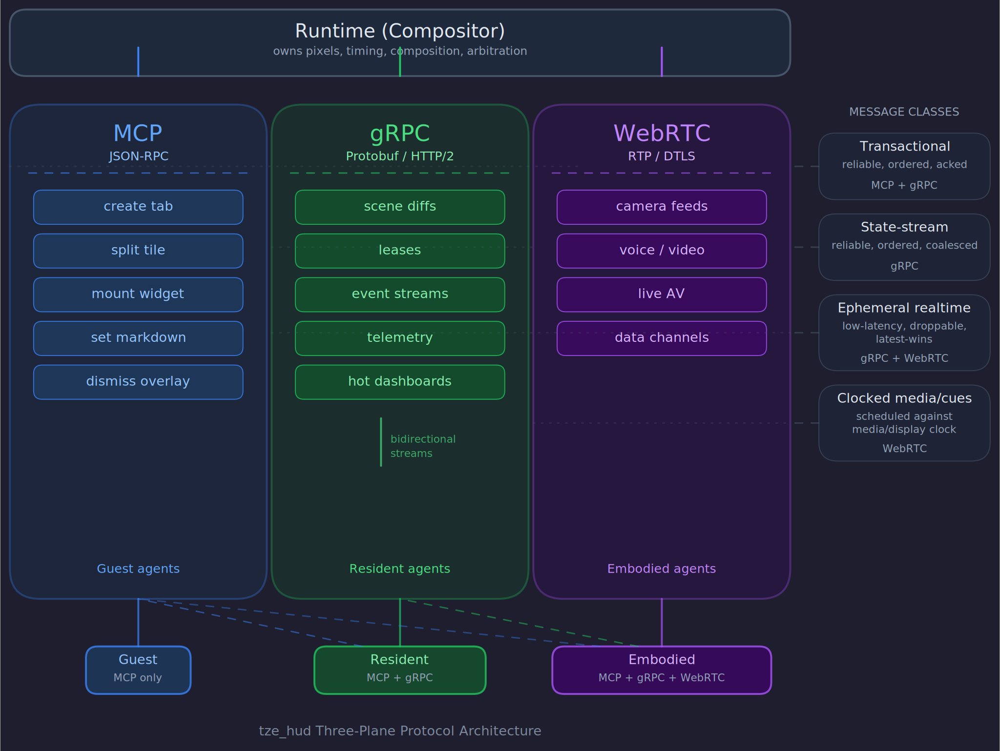

# Architecture

## The screen is sovereign

The screen belongs to the runtime, not to any individual model.

The runtime owns: pixels, timing, composition, input routing, permissions, resource budgets, arbitration, safety, and fallback behavior.

Models do not paint pixels directly. Models request, publish, or subscribe to: scene mutations, timed cues, streams, overlays, interactions, and leases.

**Rule 1: LLMs must never sit in the frame loop.** The model can drive the scene. The model cannot be the compositor. The renderer must remain deterministic, local, schedulable, and resource-aware even when remote agents are noisy, slow, buggy, or temporarily unavailable.

## Protocol planes

Trying to force one protocol to do everything will cripple the system. We need multiple planes, each matched to its traffic class.

### 1. Compatibility plane: MCP

MCP is the compatibility perimeter, not the hot path. JSON-RPC over stdio or Streamable HTTP. Use it for semantic control: create tab, split tile, mount widget, set markdown, request screenshot, dismiss overlay, subscribe to high-level state, and — critically — zone and widget publishing (`publish_to_zone`, `list_zones`, `publish_to_widget`, `list_widgets`). Zone and widget publishing via MCP is the primary LLM-first interaction surface: a single tool call, zero scene context required. Do not use MCP for high-rate deltas, touch loops, subtitle timing, media packets, or per-frame control.

### 2. Resident control plane: gRPC

Resident and embodied agents connect over native gRPC with protobuf, using one primary bidirectional session stream per agent. Scene mutations, lease management, event subscriptions, and telemetry are multiplexed over this single stream (see "Session model" below). HTTP/2 concurrent-stream limits apply — do not proliferate independent streams per agent.

### 3. Media plane: WebRTC

Live interactive audio/video lives on WebRTC: camera feeds, assistant voice/video sessions, smart-glasses live surfaces, low-latency bidirectional AV, and optional media-adjacent data channels.

### 4. Future browser/remoting plane: WebTransport

WebTransport over HTTP/3 supports both reliable streams and unreliable datagrams. Promising for browser-based remoting and selective realtime channels, but it is an adapter target for a future version, not a foundation of v1.

## Message classes

The system supports four traffic classes with different delivery semantics. Do not give all four the same transport.

**Transactional.** Reliable, ordered, acknowledged. Create tile, grant lease, switch tab, mount node, change permissions.

**State-stream.** Reliable, ordered, coalesced. Dashboard updates, scene patches, widget state, layout deltas.

**Ephemeral realtime.** Low-latency, droppable, latest-wins. Hover, cursor trails, interim speech tokens, transient sensor indicators.

**Clocked media/cues.** Scheduled against a media or display clock. AV frames, subtitles, word-highlighting, beat markers, synchronized overlays.

## Time is a first-class API concept

Arrival time is not presentation time. This rule must be baked into the entire architecture.

Every meaningful realtime payload carries timing semantics: present_at, effective_after, expires_at, sequence, priority, coalesce_key, sync_group.

A subtitle highlight means "this word is active between these timestamps in this sync group," not "highlight this word now." A touch event gets local visual acknowledgement immediately; remote semantics follow. High-rate state is coalesced to "latest coherent view," not rendered point-by-point.

## Multiple video feeds are a compositor problem

If the screen may show multiple concurrent live feeds, the system must think like a compositor, not like a web page:

- Decode as surfaces, not as "widgets"
- Keep frames GPU-resident when possible
- Avoid unnecessary memory copies
- Isolate decode, scene update, and presentation work
- Allocate budgets per tile and per stream
- Distinguish visual priority from network priority
- Accept graceful degradation as a designed behavior

A doorbell overlay, a passive ambient camera, and a high-frequency dashboard are not the same class of work. The runtime must know that.

## Compositing model

The compositor manages a layered surface stack, not a flat pixel grid. Understanding this stack is critical because it determines how tiles, overlays, media, and runtime UI interact visually.

### Terminology: surfaces

The scene model has several rectangular concepts. To keep them straight:

- A **surface** is any rectangular region the compositor renders. This is the umbrella term.
- A **tile** is a leased surface — an agent owns it directly via the lease system.
- A **zone** is a managed surface — the runtime owns it and agents publish raw content into it.
- A **widget** is a parameterized managed surface — the runtime owns the visual template (SVG layers) and agents publish typed parameter values into it. The runtime binds parameter values to visual properties and rasterizes the result.
- A **node** is content inside a surface (text, image, hit region, etc.).
- A **layer** is where a surface attaches in the compositing stack.

This vocabulary is not wire-protocol terminology — it is conceptual scaffolding for the doctrine. RFCs may use more precise terms.

### Layer stack

The compositor renders three ordered layers, back to front:

1. **Background layer.** Solid color or ambient content. Owned by the runtime, not by any agent. In overlay/HUD mode, this layer is fully transparent (passthrough to desktop).

2. **Content layer.** Agent tiles live here. Each tile is a rectangular surface with a defined z-order within this layer. Tiles are opaque by default — an agent must explicitly request transparency when creating a tile. Opaque tiles completely occlude lower-z tiles in their region; transparent tiles alpha-blend with whatever is beneath them.

3. **Chrome layer.** Runtime-owned UI: tab bar, system indicators, override controls, disconnection badges, staleness indicators. This layer is always on top. No agent can render into or occlude the chrome layer. It exists to guarantee that the human's controls are always visible and functional, regardless of what agents are doing.

### Intra-tile compositing

Within a tile, nodes are composited in tree order. A tile containing a video node and a subtitle overlay node renders the video first, then composites the subtitle text on top with alpha blending. This is how synchronized overlays work — the subtitle node and the video node share a tile, a sync group, and a media clock, and the compositor handles their visual stacking.

Nodes within a tile do not have independent z-order relative to other tiles. The tile is the unit of z-order in the scene; nodes within it are composited internally.

### What "decode as surfaces" means

When the manifesto says "decode as surfaces, not as widgets," it means: a video feed should produce a GPU-resident texture that the compositor composites directly into the tile's region. The video is not "rendered into a widget" that gets laid out by a framework — it is a raw surface that the compositor owns and places. This avoids texture copies, enables zero-copy paths for local media producers, and keeps the compositor in control of timing and presentation.

### Widget compositor pipeline

Widgets extend the compositing model with a CPU-side SVG rasterization stage that sits between parameter publication and texture composition:

1. **Registration (startup).** For each widget type loaded from an asset bundle, the compositor parses the `widget.toml` manifest, loads SVG layer files, and parses each SVG into a retained `usvg::Tree`. Parsing failures are fatal startup errors.

2. **Instance binding (startup).** For each `[[tabs.widgets]]` entry in configuration, the compositor creates a `WidgetInstance` binding the widget type to a tab with configured geometry. The instance starts at schema default parameter values.

3. **Publication (runtime).** A `WidgetPublish` message (gRPC field 35) or `publish_to_widget` MCP call arrives. The runtime validates parameter values against the widget type's schema and applies the contention policy to determine the effective publication.

4. **Binding resolution (render).** When a widget's parameters have changed, the compositor applies each parameter binding to the retained SVG tree — substituting attribute values via linear mapping (f32), direct substitution (string/color), or discrete lookup (enum) — and rasterizes the modified SVG to an RGBA texture via resvg at the widget instance's pixel dimensions.

5. **Caching.** The rasterized texture is cached and reused on subsequent frames until parameters change. Widgets whose parameters are unchanged skip stages 3–4 entirely. Re-rasterization must complete in less than 2ms for a 512×512 widget on reference hardware.

Widget tiles use z-order `>= WIDGET_TILE_Z_MIN` (0x9000_0000), which is above the zone-reserved band (`ZONE_TILE_Z_MIN` = 0x8000_0000). Widgets therefore render above zones when they overlap spatially. Widget tiles default to `input_mode = Passthrough` — they are display-only visual indicators, not interactive surfaces.

Under degradation level `RENDERING_SIMPLIFIED` or higher, the compositor may skip parameter interpolation and snap directly to final values, reducing re-rasterization to at most once per parameter change rather than once per frame during transitions.

### V1 compositing scope

V1 ships: opaque tiles, alpha-blended transparent tiles, z-order compositing, chrome layer, intra-tile node compositing (text over solid color, hit regions over content), and widget SVG layer rasterization with parameter binding and interpolation.

V1 defers: blur, glass/frosted effects, tile drop shadows, animated opacity transitions, custom blend modes, and GPU-accelerated effects pipelines. These are valuable but not load-bearing for the v1 thesis.

## Session model: one stream per agent

Each resident agent maintains one primary bidirectional gRPC session stream. Scene mutations, event subscriptions, lease management, and telemetry are multiplexed over this single stream. A separate media signaling stream may exist for embodied agents negotiating WebRTC sessions.

Do not proliferate independent long-lived streams per agent. HTTP/2 connections have concurrent-stream limits that become a bottleneck under many active streams. One session stream per agent, plus optional media signaling, is the target topology. The Session/Protocol RFC will define the multiplexing format, but the principle is: few fat streams, not many thin ones.

## Node type extensibility

Node types are registered, not hardcoded. Each node type declares:

- Its resource requirements (texture memory, CPU budget, media decode slots)
- Its serialization format (how scene state includes this node's data)
- Its telemetry surface (what per-frame metrics it emits)
- Its input behavior (does it accept hit testing? capture focus?)

The set of node types is fixed per compositor version. There is no runtime plugin system — agents cannot ship rendering code to the compositor. New node types are added by extending the compositor and releasing a new version. This is intentional: the compositor is a trusted, local, performance-critical system. Allowing arbitrary agent-supplied rendering code would violate screen sovereignty and make performance guarantees impossible.

V1 ships four node types: solid color, text/markdown, static image, and interactive hit region. The architecture must support adding more (video surface, canvas, browser surface, chart) without restructuring — but each addition is a compositor change, not an agent capability.

## Language: Rust for the core

The latency-sensitive core is written in Rust. Concurrency, predictable performance, strong typing, explicit resource ownership, safe systems integration, and graphics/media interoperability all demand it. Tokio for async runtime; tonic for gRPC.

TypeScript is acceptable for inspectors, authoring tools, admin panels, and non-critical remote consoles. Never in the hot path.

## Rendering: native GPU pipeline

The renderer is a native GPU pipeline, not a DOM-first surface. wgpu for cross-platform GPU rendering (Vulkan, Metal, D3D12, OpenGL); winit for window creation, event loop, and input — including iOS and Android targets.

A browser is acceptable for tooling, inspection, and remote admin. It is not the main renderer. gRPC-Web lacks full bidirectional streaming support; the primary renderer should not live under browser transport constraints.

## Window model: two deployment modes

The compositor supports two window modes. The scene model, lease system, and protocol planes are identical in both — only the window surface differs.

**Fullscreen mode.** The compositor owns the entire display. The background is opaque. All input is captured. This is the natural mode for a dedicated display node — a wall screen, mirror, or kiosk.

**Overlay mode (HUD).** The compositor renders a transparent, borderless, always-on-top window over the user's desktop. Non-rendered regions are fully transparent and pass input through to the underlying windows. Interactive regions (tiles with input affordances) capture input normally.

This is selective click-through: the compositor decides per-region whether input is captured or passed through. The determination follows the scene graph — a tile with an active lease and input affordances captures input in its bounds; everything outside active tiles passes through.

Selective click-through is platform-specific but well-supported on all v1 targets:

- **Windows:** `WM_NCHITTEST` returns `HTTRANSPARENT` for passthrough regions, `HTCLIENT` for interactive regions. Combined with `WS_EX_LAYERED` for transparency.
- **macOS:** Override `hitTest(_:)` on the NSView to return `nil` for passthrough regions. `NSWindow.ignoresMouseEvents` for the base case, with per-region interactivity via hit testing.
- **Linux X11:** `XShape` extension sets an input shape mask — only masked regions receive input.
- **Linux Wayland:** `wlr-layer-shell` protocol on wlroots compositors (Sway, Hyprland) supports overlay layers with configurable input regions. GNOME/KDE Wayland do not support this cleanly — overlay mode falls back to fullscreen on unsupported compositors.

The window mode is a runtime configuration choice, not a compile-time fork. The same binary supports both modes. An agent does not need to know which mode the compositor is running in — it requests leases and renders content the same way regardless.

**Promise boundary:** Fullscreen mode is guaranteed on all platforms. Overlay mode is supported where the platform provides the necessary primitives — Windows, macOS, X11, and wlroots Wayland. On platforms that lack overlay support, the runtime falls back to fullscreen gracefully. Do not treat "HUD everywhere" as a doctrine-level invariant.

## Display profiles

A display profile is the runtime's formal description of the current display environment. Zones, degradation policies, and capability negotiation all depend on it. A display profile declares:

- **Screen dimensions and DPI.** Physical size, resolution, pixel density. A 65" 4K wall display and a 6" phone have different geometry policies even for the same zone type.
- **Layer capabilities.** Does the display support transparency/overlay? How many concurrent surfaces? What is the maximum texture memory?
- **Zone geometry policies.** Per-zone positioning, sizing, margins, and adaptation rules for this profile. The subtitle zone is 5% height on a wall display, 8% on a phone, audio-only on glasses.
- **Input capabilities.** Touch, pointer, keyboard, voice, none. A wall display might have touch; glasses might have only voice and a single button.
- **Performance budget ceilings.** Maximum concurrent tiles, maximum update rate, maximum texture memory, decoder count. The degradation ladder operates within these ceilings.
- **Degradation thresholds.** At what resource pressure levels does each degradation step trigger for this profile.

V1 supports at least two built-in profiles: "desktop" (high-end local display) and "headless" (CI/test, no window). Mobile profiles are designed into the schema but not exercised until post-v1. Profiles are loaded from configuration and are not negotiated at runtime in v1 — the compositor starts with a fixed profile. The Configuration RFC and Display Profiles RFC will define the schema; the principle is that profiles are declarative, not code.

## Text rendering

Text is a runtime responsibility, not an agent concern. When an agent publishes text — whether via a text/markdown node in a tile or stream-text with breakpoints to a subtitle zone — the agent provides the content and cue metadata. The runtime handles:

- **Text shaping and layout.** Font selection, line breaking, bidirectional text, glyph positioning. The agent does not specify fonts, sizes, or line widths — those come from the zone's rendering policy or the tile's configured text style.
- **Cue segmentation.** For stream-text with breakpoints, the runtime handles word-level highlighting, timing against sync groups, and smooth transitions between cue positions.
- **Accessibility metadata.** The runtime exposes text content to platform accessibility APIs (screen readers, braille displays). The agent does not need to do this explicitly — the runtime bridges text nodes to the platform's accessibility surface automatically.

This is the same principle as zone geometry abstraction: agents declare what to show, the runtime decides how to render it. An agent that publishes "The quick brown fox" with breakpoints to the subtitle zone does not know what font, size, color, or backdrop the runtime uses. That's the point.

## Media: GStreamer

Media is not an add-on. It is one of the reasons the project exists. The media layer is built around GStreamer: graph-based pipelines, clock/timestamp/segment synchronization, Rust bindings for applications and plugins. This shapes live ingest, decode, synchronization, stream switching, timed metadata, subtitle/cue alignment, and low-latency AV composition.

## Policy arbitration

The runtime enforces policy from four sources: capabilities (security.md), privacy/attention (privacy.md), zone contention (presence.md), and degradation (failure.md). These policies will collide in real life.

Example: a guest-level agent publishes an urgent notification to a stacking zone during quiet hours while the system is degrading and the zone is chrome-attached. Which rule wins?

The answer is a fixed priority order, evaluated top-to-bottom:

1. **Human override.** Always wins. Dismiss, mute, safe mode, freeze — these are instantaneous and cannot be intercepted by any policy layer below.
2. **Capability gate.** Does the agent have the capability to publish here at all? If not, reject immediately with a structured error. No further evaluation.
3. **Privacy/viewer gate.** Does the current viewer context permit this content to be shown? If the content's classification exceeds the viewer's access, the content is redacted (not rejected — the publish succeeds, the rendering is filtered). Redaction is invisible to the agent.
4. **Interruption policy.** Is this interruption allowed right now? During quiet hours, normal and gentle interruptions are queued. Urgent and critical pass through. The interruption class is evaluated after privacy because even urgent content must be redacted if the viewer is a guest.
5. **Attention budget.** Has this agent or zone been interrupting too frequently? The runtime tracks interruption rate per-agent and per-zone. Even valid urgent interruptions may be coalesced or deferred if the attention budget is exhausted — not as punishment, but because a screen that interrupts constantly becomes noise (see attention.md). This is distinct from quiet hours: quiet hours are scheduled, attention budget is dynamic.
6. **Zone contention.** Does this publish conflict with existing zone occupancy? Apply the zone's contention policy (latest-wins, stack, merge-by-key, replace).
7. **Resource/degradation budget.** Does the runtime have sufficient resources to render this content at the current degradation level? If not, the content may be simplified, deferred, or shed according to the degradation ladder.

This is not a suggestion — it is the canonical evaluation order. The Policy/Arbitration RFC will define the implementation, but the priority order is doctrine. When in doubt about which rule wins, read this list top-to-bottom.

## System shell

The runtime is not just a compositor. It also owns a system shell: the local, always-available, agent-independent user interface that guarantees the human remains in control.

The system shell includes:

- **Tab bar.** Tab names, switching controls, current-tab indicator. Always visible in the chrome layer.
- **System indicators.** Connection status, degradation state, active agent count, viewer class.
- **Override controls.** Dismiss-all, safe mode (disconnect all agents), freeze scene, mute all media.
- **Privacy state.** Current viewer class indicator. Explicit "show private content" toggle when redaction is active.
- **Disconnection/staleness badges.** Visual indicators on orphaned or stale tiles.
- **Privilege prompts.** When an agent requests elevated capabilities (overlay privileges, chrome-layer zones, media access), the shell presents the prompt. The agent cannot bypass this.

The system shell renders entirely in the chrome layer. It does not depend on any agent — if every agent disconnects, the shell still works. It is the human's contract with the runtime: "I can always see where I am, what's happening, and how to stop it."

The System Shell RFC will define the specific UI elements, layout, interaction model, and how the shell adapts across display profiles. The doctrine-level commitment is: the shell exists, it is local, it is always available, and no agent can interfere with it.

## Error model

Every error the runtime returns — whether via gRPC, MCP, or internal telemetry — must be structured, machine-readable, and diagnostic. This is not a nice-to-have. LLMs are the primary developers and the primary agents; they cannot self-correct from "INVALID_ARGUMENT" with no details.

Every error response includes:

- **Error code.** A stable, enumerated identifier (e.g., `ZONE_TYPE_MISMATCH`, `LEASE_EXPIRED`, `BUDGET_EXCEEDED`). Codes are documented and do not change between compatible versions.
- **Human-readable message.** A short sentence explaining what went wrong.
- **Context.** The invalid field, value, or operation that triggered the error.
- **Correction hint.** A machine-readable suggestion for how to fix it (e.g., `{use_zone: "pip", reason: "subtitle zone does not accept video_surface"}`).

This applies to gRPC status details, MCP JSON-RPC error responses, and mutation batch rejection reports. The error schema is defined once and shared across all protocol planes.

Errors are not exceptional conditions to be caught and logged — they are part of the API's teaching surface. A well-structured error is as valuable as a well-structured success response, especially in the LLM development loop where errors drive iterative improvement.

## Configuration model

Tabs, zones, default layouts, quiet hours, viewer policies, degradation thresholds, agent registrations — these are all configuration. The runtime loads configuration at startup and may reload on signal.

Configuration is:

- **Declarative.** Describes the desired state, not the steps to reach it. "The Morning tab has these three zones" — not "create tab, then create zone, then..."
- **File-based.** Stored as files on disk. No database required. Editable with a text editor.
- **Human-readable.** The format must be parseable by LLMs for orchestration and by humans for debugging. No opaque binary formats.
- **Validated at load time.** Invalid configuration fails loudly at startup with structured errors, not silently at runtime.

The specific format (TOML, YAML, RON, or custom) is an RFC decision. The principle is: configuration is the primary mechanism for defining scenes, zones, and policies in v1 (before dynamic orchestration exists), so it must be a first-class, well-documented, schema-validated surface.

## Resource lifecycle

Resources — textures, fonts, images, media handles — are reference-counted and owned by the scene graph.

- When an agent uploads an image for a tile, the image texture is owned by the node that references it.
- When the node is replaced, the tile is deleted, or the lease is revoked, the reference count drops.
- When the last reference is removed, the resource is freed.
- The runtime does not cache resources beyond their scene graph lifetime without explicit policy (e.g., a font cache may persist across tile lifecycles, but agent-uploaded content does not).

This means resource accounting is deterministic and testable: after a tile is deleted, its texture memory is reclaimed. After an agent disconnects and its leases expire, its resource footprint is zero. The telemetry surface tracks resource allocation and deallocation per-agent, per-frame.

Resource leaks are treated as correctness bugs, not performance bugs. The soak/leak test suite (see validation.md) verifies that hours-long sessions with repeated agent connects/disconnects do not monotonically grow memory.

## Versioning and protocol compatibility

The gRPC session protocol is versioned. Agents declare their protocol version on handshake. The compositor supports the current version and one prior major version.

- **Minor versions** add new optional fields, new node types, new zone types. Agents that don't know about a new node type see it as an opaque placeholder in scene topology queries.
- **Major versions** may change wire format, remove deprecated fields, or alter fundamental semantics. They require an explicit migration.
- **MCP tools** are versioned alongside the gRPC protocol. A new node type that ships with compositor v1.2 also ships as a new MCP tool in the same release.

The principle: agents should not break when the compositor upgrades within a major version. The compositor should not break when connected to an agent from one major version ago. Unknown elements are represented, not rejected.

## Anti-patterns

Quick reference — these are expanded in their parent sections:

- LLM in the frame loop
- Live media on MCP
- Browser as main renderer
- Verbose JSON on hot paths
- Touch depending on remote roundtrip
- Arrival time assumed equal to presentation time
- Unbounded agent screen territory
- Forked desktop/mobile API
- Graceful degradation treated as a bug
- Unstructured or opaque error responses (see error model)
