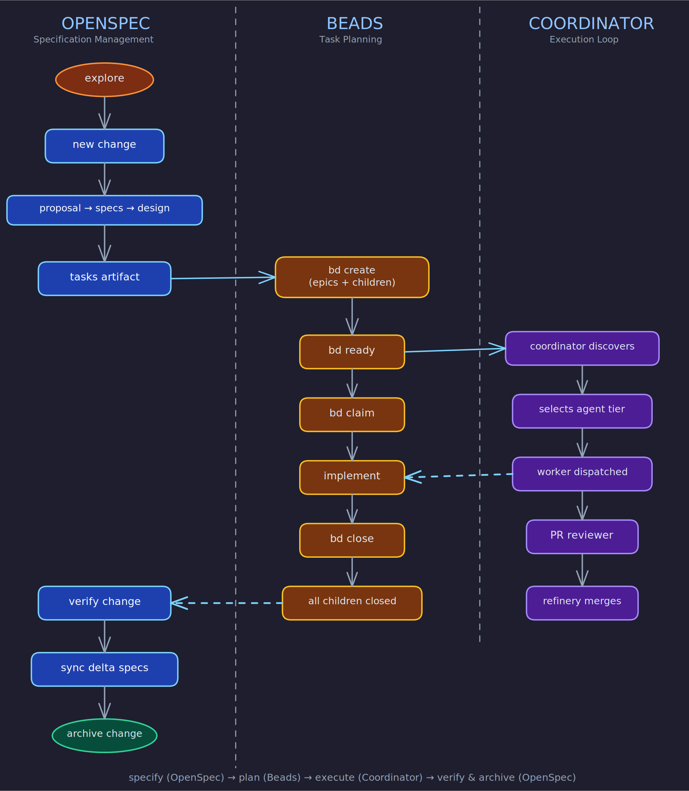

# Development Methodology

How this project is built: specification-driven, dependency-aware, with strict role separation between planning, execution, and review.

## Core Technologies

Three tools form the development cycle. Each owns a distinct concern; together they cover the full path from idea to merged code.

### OpenSpec — Specification Management

OpenSpec is the artifact-driven specification system. It manages the lifecycle of every change from exploration through implementation to archival.

- **Change** — A directory containing all artifacts for a single feature, fix, or modification.
- **Artifacts** — Structured documents in dependency order: proposal, specs (with requirements and scenarios), design decisions, implementation tasks.
- **Delta specs** — Specs within a change describing additions, modifications, or removals. Synced to main capability specs after implementation.
- **Explore mode** — Thinking-partner mode for investigating problems before committing to artifacts.
- **Verification** — Three-dimensional check (completeness, correctness, coherence) before archiving.

**Lifecycle:** explore → new → continue/ff → apply → verify → sync → archive

**Principle:** No artifact is created without reading its dependencies first. No implementation begins until required artifacts are complete. No change is archived until verified.

### Beads — Task Planning and Dependency Chains

Beads (`bd`) is the dependency-aware issue tracker backed by Dolt. It replaces markdown TODOs, external trackers, and ad-hoc task lists.

- **Bead** — A work item with type (task/bug/feature/chore/epic), priority (P0–P4), status, description, acceptance criteria, and dependency edges.
- **Dependencies** — Explicit blockers between beads. `bd ready` returns only unblocked work. `discovered-from` links trace how new issues were found during implementation.
- **Epics** — Parent beads with children. Non-trivial epics (>=3 children) require a reconciliation bead and an epic report bead.
- **Atomic claiming** — `bd update <id> --claim` prevents two agents from working the same bead.

**Principle:** `bd ready` is the single source of truth for "what should I work on next." All discovered work becomes a linked bead, not a TODO comment.

### Coordinator / Worker / PR-Reviewer — The Execution Loop

The execution machinery turns ready beads into merged code through three roles with strict ownership boundaries.

**Coordinator** — Discovers work, selects agents, dispatches, monitors. Never implements code. Runs periodic health checks, escalates repeated failures, handles epics.

**Worker** — Implements a single bead in an isolated worktree. Four phases: understand (read bead, specs, code), implement (write code within acceptance criteria), verify (tests, linters, quality gates), handoff (PR or direct-merge, report discovered work).

**PR Reviewer** — Reviews PRs, posts comments, iterates, merges when guard conditions pass. Six conditions before merge: CI passing, no unresolved threads, no `.beads/` divergence, approval present, branch up-to-date, no merge conflicts.

**Cleanup** — State reconciliation at the start of every coordinator loop: orphaned in-progress beads, stale PR-review beads, resolved blockers, orphaned worktrees.

**Principle:** The coordinator never implements. Workers never coordinate. The PR reviewer never modifies implementation. Each role owns its phase.

## The Flow

Specify (OpenSpec) → Plan (Beads) → Execute (Coordinator/Worker/Reviewer) → Verify and archive (OpenSpec).

## Development Principles

### 1. Specifications are the source of truth

Every work item links to a spec section. If none exists, writing the spec is the first task. No implementation before spec signoff.

Start unclear work with explore mode. Delta specs describe what changes. Verification checks completeness, correctness, and coherence before archiving.

**Exceptions:** Pure refactors that don't change behavior, and bug fixes where the spec already defines correct behavior, may skip signoff — but still require reconciliation.

### 2. Evidence over assumption

Every major claim cites specific files, functions, or spec sections. Label assertions: **[Observed]** (seen in code/docs), **[Inferred]** (deduced from patterns), **[Unknown]** (not addressed). Treat documentation as claims to validate, not truth. Every criticism includes a concrete remedy.

### 3. Evaluate work across eight dimensions

Before committing to any feature, improvement, or refactor:

| Dimension | Key question |
|-----------|-------------|
| Alignment | Does this serve the project's core purpose, or dilute it? |
| User value | Does it unblock a real workflow or fix a real pain? |
| Leverage | How much future work does this enable or simplify? |
| Tractability | Can this be done well right now? |
| Timing | Is now the right moment, or does prep work need to land first? |
| Dependencies | What must exist before this can begin? |
| Implementation risk | How many unknowns? How likely is a pivot? |
| Churn likelihood | Will requirements shift and force a rewrite? |

Prioritize by: **user value > leverage > tractability > timing**.

### 4. Classify, don't just prioritize

Sort proposed work into buckets:

- **Aligned next steps** — High value, tractable, serve core purpose. Goes into the work plan.
- **Premature work** — Aligned but not yet tractable. State what's needed first.
- **Deferred work** — Aligned and tractable but lower priority. Include revisit triggers.
- **Misaligned ideas** — Don't serve core purpose. Be specific about why.
- **Rejected work** — Should not be done. Be blunt with reasons.

### 5. Push back early and explicitly

Flag work that is: overreaching, premature optimization, feature creep, architecture avoidance, spec drift, wishful thinking, or churn-prone. If the project is overreaching, say so directly with evidence.

### 6. Decompose into verifiable chunks

Target 3–10 hours per chunk. Each must be independently completable, clearly scoped, verifiable with concrete acceptance criteria, and spec-linked.

Sequencing: express constraints as bead dependencies. Serialize chunks that touch the same module or shared interfaces. Only parallelize when chunks touch different files with no shared interfaces. When in doubt, add a dependency edge.

### 7. Reconcile after every chunk

After each chunk: does behavior match spec? Do tests cover acceptance criteria? Was drift introduced? Is the spec still accurate? Is follow-up documented as beads?

After a logical block, the reconciliation bead fires: end-to-end flow verification, regression check, spec currency review.

### 8. Project health categories

Audit current state across 15 categories, scored 1–5:

| # | Category | What it covers |
|---|----------|---------------|
| 1 | Goal alignment | Do claims match implementation? |
| 2 | Architecture | Module boundaries, coupling, dependency direction |
| 3 | Code clarity | Naming, readability, style consistency |
| 4 | Correctness | Bug patterns, edge cases, race conditions |
| 5 | Error handling | Failure behavior, recovery paths, error messages |
| 6 | Observability | Logging, metrics, tracing, diagnosability |
| 7 | Testing | Coverage strategy, test quality, CI integration |
| 8 | Tooling/hygiene | Linting, formatting, automation, developer scripts |
| 9 | Dependencies | Currency, CVEs, lock files, transitive risk |
| 10 | Security | Auth, input validation, secrets management |
| 11 | Performance | Algorithm complexity, caching, query efficiency |
| 12 | Data/API design | Schema quality, API consistency, versioning |
| 13 | Documentation/DX | Onboarding, API docs, setup experience |
| 14 | Release/ops | CI/CD, versioning, rollback, health checks |
| 15 | Maintainability | Change safety, type coverage, code review |

Calibrate to project type and maturity — a prototype scoring 3 on testing is adequate; a production service scoring 3 is a risk.

### 9. Calibrate to project type

For tze_hud specifically, elevate: architecture, correctness, performance, testing, security, API design. Lower: docs (until public API), release/ops (until production deployment).

Maturity expectations scale from prototype (optional tests, console logging) through production (full suite, metrics + tracing, security review) to mission-critical (enforced gates, full stack observability, threat model).

### 10. Build a risk register

For every identified risk: title, severity (critical/high/medium/low), likelihood, evidence (specific files/patterns), and concrete remedy with effort estimate. Order by severity x likelihood.

### 11. Plan across three horizons

| Horizon | Focus | Typical items |
|---------|-------|---------------|
| Quick wins (1–3 days) | Immediate ROI, low risk | Linter config, missing error handling, doc fixes |
| Medium improvements (1–3 weeks) | Meaningful quality/capability gains | Test coverage, auth hardening, API consistency |
| Strategic investments (1–3 months) | Long-term viability | Architecture refactors, observability stack, migration |

### 12. Minimize churn

- Favor removing dead paths over backward-compatibility shims.
- Serialize work that would conflict.
- Don't design for hypothetical future requirements.
- Don't add features beyond what was asked.
- Three similar lines is better than a premature abstraction.
- If something is unused, delete it completely.

### 13. Maintain direction awareness

Periodically answer with evidence: What is this project actually becoming? What should it work on next? What should it stop pretending it can do?

Check for spec drift in both directions: code ahead of spec, spec ahead of code, or diverging.

### 14. Verdicts have criteria

| Verdict | Criteria |
|---------|----------|
| Healthy | No category below 3; no critical risks; average >= 3.5 |
| Healthy but fragile | No category below 2; <=1 critical risk; average >= 3.0 |
| Accumulating debt | 1–3 categories below 3; average 2.5–3.5; trajectory negative |
| At risk | 3+ categories below 3, or any at 1, or 2+ critical risks |
| Severely at risk | 5+ below 3, or multiple at 1, or critical security/data risks |

### 15. Close the loop

Work is not done until: acceptance criteria verified against spec, adjacent features confirmed unbroken, follow-up captured as beads, delta specs synced, changes committed and pushed, beads closed with reasons, change verified and archived.

Each role's ownership boundary:

| Role | Owns | Does NOT do |
|------|------|-------------|
| Coordinator | Discovery, dispatch, monitoring, escalation | Implementing, merging, closing implementation beads |
| Worker | Understanding, implementing, verifying, handing off | Coordinating others, mutating beads beyond scope |
| PR Reviewer | Reviewing, commenting, merging when conditions pass | Modifying implementation, changing bead scope |
| Cleanup | Reconciling stale state: orphaned beads, dead sessions | Implementation decisions, closing real work beads |
