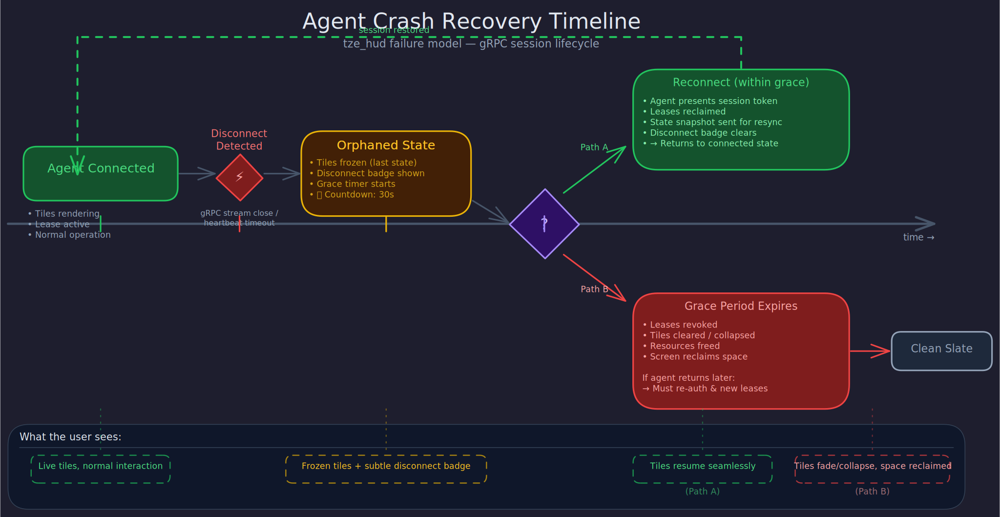

# Failure and Recovery

Graceful degradation is mentioned throughout this project's doctrine. This document makes it concrete: what happens when things break, what the user sees, and what the system guarantees.

## Core principle

The runtime must always be usable, even when agents are not. No agent failure — crash, hang, disconnect, misbehavior — should make the screen unresponsive, blank, or stuck. The worst case is "some tiles are empty." The screen itself never fails because an agent failed.

## Agent failure modes

### Agent crashes

The agent process dies or the connection drops unexpectedly.

**What the runtime does:**
1. Detects disconnection (gRPC stream close, WebRTC ICE failure, heartbeat timeout).
2. Marks the agent's leases as "orphaned" — still rendered but frozen at last known state.
3. Displays a subtle visual indicator on affected tiles (e.g., a dim "disconnected" badge — not a modal, not an error dialog).
4. Starts a reconnection grace period (configurable, default 30 seconds).
5. If the agent reconnects within the grace period: it can reclaim its leases and resume. Scene state is preserved. The disconnection badge clears.
6. If the grace period expires: leases are revoked, tiles are cleared or collapsed, resources are freed. The screen reclaims the space.

### Agent is slow

The agent is connected but responding slowly — updates arrive late, acknowledgements time out, media frames are delayed.

**What the runtime does:**
1. Coalesces the agent's state-stream updates more aggressively.
2. Degrades the agent's media quality (lower resolution, lower frame rate).
3. If the agent's tiles depend on fresh data and the data is stale beyond a threshold, displays a staleness indicator.
4. Does not revoke the lease — slowness is not failure. But the agent's effective resource budget is reduced to protect the rest of the scene.

### Agent is noisy

The agent is flooding updates, exceeding its bandwidth budget, or consuming disproportionate resources.

**Handled by resource governance** (see security.md): warning, throttling, then revocation if sustained.

### Agent misbehaves

The agent attempts to render outside its lease bounds, claim tiles it doesn't own, or escalate its own capabilities.

**What the runtime does:**
1. Rejects the invalid operation.
2. Logs the violation with agent identity and details.
3. If violations are repeated: revoke the agent's session. This is a security boundary, not a performance boundary.

### Zone content during agent failure

When an agent that published to a zone disconnects, the zone's timeout and cleanup policy governs what happens — not the agent's lease state (zones are runtime-owned, not agent-owned):

- **Ephemeral zones** (subtitle): content auto-clears after the zone's timeout, regardless of agent state. A disconnected agent's subtitle disappears on schedule.
- **Durable zones** (status-bar): content persists until explicitly replaced by another publish. A disconnected agent's status-bar entry remains visible until another agent overwrites it or the runtime clears it.
- **Stacking zones** (notification): each notification follows its own timeout. A disconnected agent's queued notifications continue to auto-dismiss normally.

This is a direct consequence of the design choice that zone content is owned by the runtime, not by the publishing agent (see presence.md, "Guest agents and zone leases").

## Scene persistence

### Display node restart

The scene model is ephemeral by default. When the display node process restarts, the scene is empty. Agents must reconnect and re-establish their presence.

This is intentional. Persisting scene state across restarts introduces complex reconciliation problems: what if an agent's desired state has changed? What if its lease was about to expire? What if the scene configuration has been updated? Starting clean is simpler and more predictable.

However, the runtime persists:

- **Agent registration and capability grants.** A known agent does not need to re-authenticate from scratch on every reconnect — its identity and approved capabilities are durable.
- **Tab and layout configuration.** The set of tabs, their names, and their default layouts are configuration, not runtime state. They survive restarts.
- **User preferences.** Pinned tiles, muted agents, frozen regions, z-order overrides — these are the human's choices and must survive restarts.

### Reconnection contract

When an agent reconnects after a disconnect (within or outside the grace period):

- **Within grace period:** The agent can reclaim its existing leases by presenting its session token. Scene state is preserved. The agent receives a state snapshot to resynchronize.
- **After grace period:** Leases have been revoked. The agent must request new leases from scratch. It receives the current scene topology so it can make informed requests.
- **After display node restart:** All leases are gone. The agent authenticates, receives its capability grants, and negotiates new leases. Tab/layout configuration is intact so the agent can request its preferred regions.

## Degradation axes

The runtime can degrade along explicit, designed axes. This is not failure — it is the product behaving correctly under a constrained operating envelope.

Degradation is ordered by impact, lightest first:

1. **Coalesce more aggressively.** Reduce update frequency for state-stream tiles. Visually identical for slowly-changing content.
2. **Reduce media quality.** Lower resolution, lower frame rate for video tiles. Noticeable but functional.
3. **Reduce concurrent streams.** Drop auxiliary/thumbnail video feeds, keep primary. Significant but preserves the most important content.
4. **Simplify rendering.** Disable transitions, effects, transparency blending. Visually simpler but functionally complete.
5. **Shed tiles.** Collapse low-priority tiles to free resources for high-priority ones. Content is lost but the system remains responsive.
6. **Audio-first fallback.** If the display pipeline is overwhelmed, fall back to audio-only for media agents. Last resort before full disconnection.

The runtime chooses the degradation level based on current resource pressure and tile priorities. It does not ask the user — it acts, and the user can override.

## What the user always sees

Regardless of failure mode:

- The screen is responsive to touch/input: local visual feedback (press state, focus ring) within 4ms (input_to_local_ack budget).
- Tab switching works.
- The "dismiss all" / "safe mode" override works.
- Empty regions show a clean background, not a crash screen.
- Disconnected tiles are visually distinct from active tiles (subtle, not alarming).
- The runtime's own UI (tab bar, system indicators, override controls) never depends on any agent and never fails because an agent failed.
