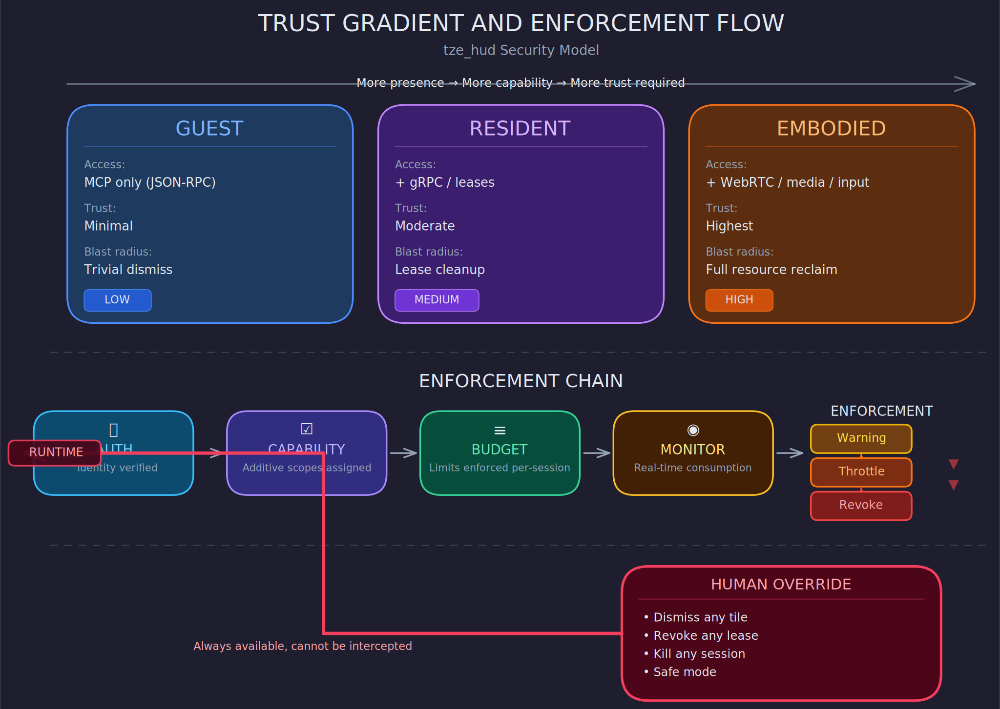

# Security and Trust

This system gives remote LLM agents pixel-level access to a user's screen, input events, and live media streams. The security model is not an afterthought — it is the mechanism that makes the sovereignty doctrine enforceable.

## Trust gradient

Trust scales with presence level. More presence means more capability means more required trust.

**Guest agents** have the least access: they issue one-off commands via MCP, receive a response, and disconnect. They cannot subscribe to events, hold leases, or access media streams. Authentication is required but capability scope is minimal. A guest that misbehaves is trivially dismissed — it has no persistent state to corrupt.

**Resident agents** hold long-lived sessions with ongoing resource consumption. They subscribe to scene events, hold surface leases, and receive continuous state updates. They require stronger authentication, explicit capability grants, and active resource monitoring. A resident that misbehaves can be revoked, but cleanup is more involved — leases must be reclaimed, subscriptions torn down, surfaces cleared.

**Embodied agents** have the highest access: real-time media streams, input events (touch, voice), bidirectional AV. An embodied agent that misbehaves has the largest blast radius — it could be consuming significant GPU, network, and decoder resources. Embodied presence requires the strongest authentication and the most restrictive default capabilities, elevated only by explicit grant.

## Authentication

Every agent connection must be authenticated before any capability is granted. The runtime does not accept anonymous connections at any presence level.

The authentication mechanism is pluggable — the runtime defines an auth trait, not a specific protocol. Reasonable implementations include:

- Pre-shared API keys for local/trusted agents
- mTLS for agent-to-runtime connections over gRPC
- OAuth2/OIDC tokens for remote or third-party agents
- Local Unix socket credentials for same-machine agents

The choice depends on deployment context. A home display node with only local agents has different needs than a display node accepting connections from remote agent services. The runtime must support both without changing the capability model.

## Capability scopes

Authentication establishes identity. Capability scopes establish what that identity is allowed to do.

Capabilities are granted per-session, not per-agent-type. An agent that was trusted yesterday can be restricted today. Capabilities are:

- **Additive, not subtractive.** An agent starts with no capabilities and receives explicit grants. There is no "admin mode" that gets selectively restricted.
- **Granular.** Separate capabilities for: create tiles, modify own tiles, read scene topology, subscribe to scene events, hold overlay privileges, access input events, stream media, use high-priority z-order, exceed default resource budgets, publish to specific zones (zone-publish grants are per-zone, not blanket), publish to specific widgets, and register runtime SVG/widget assets.
- **Revocable at any time.** The runtime can revoke any capability mid-session. The agent receives a notification and must comply. If it does not comply within a grace period, the runtime forcibly terminates the session.
- **Auditable.** Every capability grant and revocation is logged with timestamp, agent identity, and reason.

## Agent isolation

Agents are isolated by default:

- An agent cannot read the content of another agent's tiles.
- An agent cannot intercept another agent's input events.
- An agent cannot access another agent's media streams.
- An agent cannot modify another agent's leases or resources.

Topology visibility is policy-driven (see privacy.md). By default, agents see only their own leases and the public scene structure (tab names, tile geometry). Agents with explicit topology-read capability can see the full topology. This is more restrictive than "agents see everything" because on a household surface, even knowing which agents hold leases can leak sensitive context.

Cross-agent data sharing is opt-in: an agent can publish state to a shared namespace that other agents can read. The runtime mediates this — agents do not have direct access to each other's memory or streams.

## In-process media and runtime workers

The compositor is a single trusted OS process (see RFC 0002 §1.1 "Single-Process Model"). Agents reach it across gRPC and MCP wires; they never load code into it. Media decode, scheduling, and watchdog work happen on tokio tasks and library-managed threads — notably GStreamer's pipeline thread pool and WebRTC's transport threads — inside that one process, not in subprocesses. This is intentional and compatible with the agent-isolation posture above:

- The trust boundary this document governs is the **agent-runtime wire**, not an internal thread boundary inside the runtime. In-process workers sit entirely on the trusted side of that boundary.
- Cross-agent isolation invariants (no read of another agent's tiles, input events, media streams, or leases) are properties the **runtime mediates between agents**. They do not depend on per-agent process separation; they depend on the runtime correctly tagging streams with their owning session and denying cross-session reads. An in-process worker pool is no weaker here than the gRPC server's own tokio runtime.
- Resource governance — texture memory, bandwidth, concurrent streams, CPU time, decoder slots — is enforced by the in-process budget watchdog using the warning → throttle → revocation cascade described in §"Resource governance" below. E24's budget watchdog and per-stream session attribution are the implementation of that cascade for the media class of work.
- GPU device ownership remains exclusive to the compositor thread (RFC 0002 §2.8 "Future: Media Worker Boundary"). Media workers deliver decoded frames over a bounded ring buffer and never access the wgpu device directly.

The v1 architecture ratified this design in RFC 0002 §1.1 (Single-Process Model) and §2.8 (Media Worker Boundary), which reserves in-process GStreamer and WebRTC threads explicitly. E24's tokio-task layer sits above the GStreamer pipeline pool, orchestrating pipeline lifecycle and enforcing budgets — consistent with that boundary.

Subprocess isolation of codecs is a legitimate post-v2 defense-in-depth hardening if the threat model later admits untrusted-codec or agent-supplied-decoder cases (see hud-lezjj). v2's bounded-ingress scope from trusted-codec sources does not require it.

## Resource governance

Capability scopes govern what an agent can do. Resource budgets govern how much.

Every session has enforced limits on:

- Texture memory
- Bandwidth (update rate, payload size)
- Concurrent streams
- CPU time for agent-triggered scene updates
- Number of active leases
- Runtime asset storage and upload budget (bytes/day, bytes/session, and total durable footprint)

The runtime monitors resource consumption in real time. If an agent exceeds its budget:

1. Warning event sent to the agent
2. If not corrected within grace period: resource is throttled (updates coalesced more aggressively, streams quality-reduced)
3. If sustained: lease revocation and session termination

This is not punitive — it is the system protecting itself and other agents from a noisy neighbor. The same mechanism handles both malicious and merely buggy agents. The runtime does not need to distinguish intent; it enforces budgets.

Runtime SVG upload/register is governed by the same principles:

- Upload/register requires an explicit capability; publish capability alone is insufficient.
- Asset identity is content-addressed using a strong hash (BLAKE3). Agents may provide a fast transport checksum (for example CRC32), but deduplication and authority are based on the strong hash.
- The runtime can reject uploads that exceed per-agent or global durable storage budgets, even if the agent still has publish permission.

## Human override

The human is always the ultimate authority. No agent, regardless of trust level or capability scope, can prevent the human from:

- Dismissing any tile or overlay
- Revoking any lease
- Terminating any agent session
- Muting any media stream
- Freezing the scene
- Entering a "safe mode" that disconnects all agents

These overrides are handled locally by the runtime, not routed through an agent. They cannot be intercepted, delayed, or vetoed.
