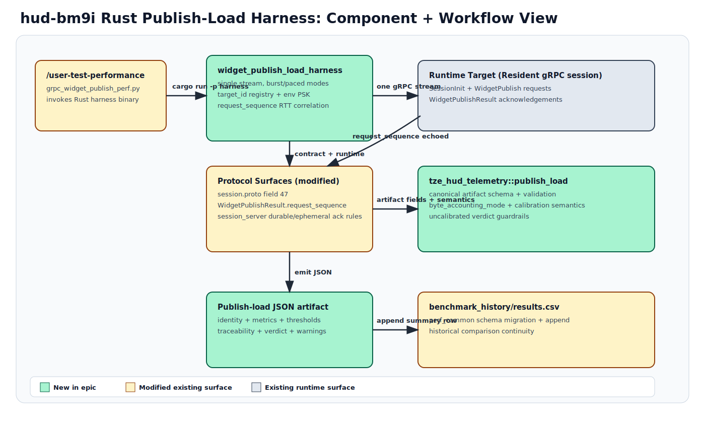

# Epic Report: Build Rust widget publish load harness

**Epic ID**: `hud-bm9i`  
**Date**: 2026-04-10  
**Report Issue**: `hud-bm9i.6`  
**Status Snapshot**: 5/6 child beads closed; epic remains open pending report handoff and follow-up closure  
**Spec coverage**:
- `openspec/changes/rust-widget-publish-load-harness/specs/publish-load-harness/spec.md`
- `openspec/changes/rust-widget-publish-load-harness/specs/session-protocol/spec.md`
- `openspec/changes/rust-widget-publish-load-harness/specs/validation-framework/spec.md`

## Summary

This epic delivered the first Rust-native resident gRPC widget publish-load harness path, closing the core honesty gap in repeated publish RTT measurement by adding request-sequence correlation on durable `WidgetPublishResult` acknowledgements. The implementation also established a canonical publish-load artifact contract and routed `/user-test-performance` gRPC runs through the Rust harness while preserving historical CSV comparison behavior.

Implementation choices prioritized contract clarity and auditability over premature abstraction. The protocol change was constrained to durable widget publish acknowledgements, artifact semantics were centralized in `tze_hud_telemetry`, and the harness emits stable comparison identity + calibration semantics directly into JSON artifacts before CSV projection.

Current state is strong on core protocol, harness execution, and artifact semantics. Three follow-up gaps are already tracked as separate beads: explicit fail-fast handling for unsupported transport intents, Layer 4 manifest wiring for publish-load artifacts, and default target-registry alignment with `user-test-windows-tailnet` examples.

---

## Architecture



Diagram notes:
- Green: newly added components for this epic.
- Yellow: modified existing components.
- Gray: existing unaffected surfaces.
- Purple: external operator/target context.

---

## Implementation Walkthrough

### `hud-bm9i.1` — Add WidgetPublishResult request correlation
**Status**: closed (`gh-pr:409`)  
**Spec section**: `session-protocol/spec.md` Requirement: Widget Publish Result

**What was done**:
- Added `request_sequence` to `WidgetPublishResult` contract and runtime emission paths.
- Ensured accepted/rejected durable widget publishes echo the originating client envelope sequence.
- Added tests for repeated durable publishes and no-result behavior for ephemeral publishes.

**Key code locations**:
- `crates/tze_hud_protocol/proto/session.proto:586-592`
- `crates/tze_hud_protocol/src/session_server.rs:5072-5223`
- `crates/tze_hud_protocol/src/session_server.rs:11243-11292`
- `crates/tze_hud_protocol/tests/widget_publish_integration.rs:145-210`

### `hud-bm9i.2` — Implement publish-load artifact and verdict schema
**Status**: closed (`gh-pr:411`)  
**Spec sections**: `publish-load-harness/spec.md`, `validation-framework/spec.md`

**What was done**:
- Introduced canonical publish-load artifact structs/enums with explicit byte-accounting modes and calibration/verdict fields.
- Added artifact validation logic enforcing workload-shape, count, byte-accounting, and uncalibrated-semantics invariants.
- Added schema/validation tests covering required fields and semantic constraints.

**Key code locations**:
- `crates/tze_hud_telemetry/src/publish_load.rs:13-170`
- `crates/tze_hud_telemetry/src/publish_load.rs:234-307`
- `crates/tze_hud_telemetry/tests/publish_load_artifact.rs:7-173`
- `crates/tze_hud_telemetry/src/lib.rs:16-18`

### `hud-bm9i.3` — Create Rust gRPC widget publish harness crate
**Status**: closed (`gh-pr:415`)  
**Spec section**: `publish-load-harness/spec.md`

**What was done**:
- Added `examples/widget_publish_load_harness` workspace crate and binary.
- Implemented CLI parsing, target resolution by `target_id`, resident session bootstrap/auth flow, and single-stream publish/ack execution.
- Implemented burst/paced modes, per-request RTT via `request_sequence` correlation, and artifact emission.

**Key code locations**:
- `Cargo.toml:20-23`
- `examples/widget_publish_load_harness/Cargo.toml:1-20`
- `examples/widget_publish_load_harness/src/main.rs:26-210`
- `examples/widget_publish_load_harness/src/main.rs:254-337`
- `examples/widget_publish_load_harness/src/main.rs:551-604`
- `targets/publish_load_targets.toml:1-9`

### `hud-bm9i.4` — Route `/user-test-performance` gRPC runs to Rust harness
**Status**: closed (`gh-pr:420`)  
**Spec section**: `publish-load-harness/spec.md`

**What was done**:
- Switched gRPC performance workflow to call the Rust harness via `cargo run -p widget_publish_load_harness`.
- Preserved artifact append + historical CSV comparison flow.
- Kept MCP benchmarking path unchanged.

**Key code locations**:
- `.claude/skills/user-test-performance/scripts/grpc_widget_publish_perf.py:67-124`
- `.claude/skills/user-test-performance/scripts/grpc_widget_publish_perf.py:185-197`
- `.claude/skills/user-test-performance/scripts/perf_common.py:11-51`
- `.claude/skills/user-test-performance/scripts/perf_common.py:139-175`
- `.claude/skills/user-test-performance/SKILL.md:13-41`

### `hud-bm9i.5` — Reconcile spec-to-code (gen-1)
**Status**: closed  
**Spec sections**: all delta specs above

**What was done**:
- Produced full requirement-to-evidence reconciliation and surfaced concrete retained gaps.
- Spawned follow-up gap beads for transport fail-fast, Layer 4 manifest wiring, and target-registry drift.

**Key code locations**:
- `docs/reconciliations/rust_widget_publish_load_harness_reconciliation_gen1_20260410.md:16-63`

---

## Spec Compliance Matrix

| Spec Section | Status | Evidence | Notes |
|---|---|---|---|
| `session-protocol/spec.md` WidgetPublishResult carries request correlation + fields | Implemented | `crates/tze_hud_protocol/proto/session.proto:586-592` | `request_sequence` present; field 47 payload retained. |
| `session-protocol/spec.md` accepted durable result echoes request sequence | Implemented | `crates/tze_hud_protocol/src/session_server.rs:5154-5167` | Success path emits `request_sequence`. |
| `session-protocol/spec.md` rejected durable result echoes request sequence | Implemented | `crates/tze_hud_protocol/src/session_server.rs:5207-5220` | Error path emits correlated rejection result. |
| `session-protocol/spec.md` repeated publishes remain distinguishable | Implemented | `crates/tze_hud_protocol/src/session_server.rs:11243-11292` | Test asserts distinct request-sequence echo for repeated publishes. |
| `session-protocol/spec.md` no result for ephemeral publish | Implemented | `crates/tze_hud_protocol/src/session_server.rs:5070-5071`; `crates/tze_hud_protocol/src/session_server.rs:11294-11301` | Durable-only result behavior maintained and tested. |
| `publish-load-harness/spec.md` Rust harness exists with real resident bootstrap on one stream | Implemented | `examples/widget_publish_load_harness/src/main.rs:254-279` | Single gRPC session stream and SessionInit path used. |
| `publish-load-harness/spec.md` target registry keyed by `target_id`; no hardcoded credentials | Partially implemented | `examples/widget_publish_load_harness/src/main.rs:622-635`; `examples/widget_publish_load_harness/src/main.rs:259-263`; `targets/publish_load_targets.toml:4-9` | Registry + env-driven auth implemented; default registry scenario drift tracked. |
| `publish-load-harness/spec.md` burst + paced workload modes | Implemented | `examples/widget_publish_load_harness/src/main.rs:33-45`; `examples/widget_publish_load_harness/src/main.rs:284-325` | Mode-specific validation and execution present. |
| `publish-load-harness/spec.md` per-request RTT via request-sequence correlation + aggregate metrics | Implemented | `examples/widget_publish_load_harness/src/main.rs:551-604`; `examples/widget_publish_load_harness/src/main.rs:242-251` | Inflight map keyed by request sequence drives RTT computation. |
| `publish-load-harness/spec.md` explicit byte-accounting semantics | Implemented | `crates/tze_hud_telemetry/src/publish_load.rs:28-31`; `crates/tze_hud_telemetry/src/publish_load.rs:234-257`; `examples/widget_publish_load_harness/src/main.rs:426-431` | Payload-only minimum enforced; wire bytes gated by mode. |
| `publish-load-harness/spec.md` artifact output + CSV compatibility | Implemented | `examples/widget_publish_load_harness/src/main.rs:642-647`; `.claude/skills/user-test-performance/scripts/perf_common.py:80-129`; `.claude/skills/user-test-performance/scripts/perf_common.py:163-175` | Canonical JSON plus ledger-compatible CSV append path. |
| `publish-load-harness/spec.md` uncalibrated verdict semantics for remote w/o mapping | Implemented | `crates/tze_hud_telemetry/src/publish_load.rs:259-307`; `examples/widget_publish_load_harness/src/main.rs:366-375` | Enforced in both harness verdict wiring and artifact validation. |
| `publish-load-harness/spec.md` explicit fail-fast for unsupported MCP/zone/tile intents | Deferred | `docs/reconciliations/rust_widget_publish_load_harness_reconciliation_gen1_20260410.md:25-26`; `docs/reconciliations/rust_widget_publish_load_harness_reconciliation_gen1_20260410.md:50-55` | Tracked by `hud-6bkd`. |
| `validation-framework/spec.md` Layer 3 distinct publish-load evidence + audit fields | Implemented | `crates/tze_hud_telemetry/src/publish_load.rs:147-161`; `crates/tze_hud_telemetry/tests/publish_load_artifact.rs:63-87` | Artifact schema includes identity/metrics/threshold/traceability/calibration fields. |
| `validation-framework/spec.md` Layer 4 artifact directory + manifest references | Deferred | `docs/reconciliations/rust_widget_publish_load_harness_reconciliation_gen1_20260410.md:34-35`; `docs/reconciliations/rust_widget_publish_load_harness_reconciliation_gen1_20260410.md:55-59` | Tracked by `hud-lh9k`. |
| `validation-framework/spec.md` calibrated vs uncalibrated semantics | Implemented | `crates/tze_hud_telemetry/src/publish_load.rs:259-307`; `crates/tze_hud_telemetry/tests/publish_load_artifact.rs:119-160` | Validator enforces reciprocal semantics between calibration status and verdict. |

---

## Test Coverage

### New/changed test files

| File | Tests | What it covers |
|---|---:|---|
| `crates/tze_hud_protocol/tests/widget_publish_integration.rs` | 10+ widget publish protocol tests | Proto round-trip + envelope field behavior for `WidgetPublishResult` and request correlation semantics. |
| `crates/tze_hud_telemetry/tests/publish_load_artifact.rs` | 7 tests | Artifact schema required fields, byte-accounting constraints, uncalibrated/calibrated verdict invariants, and count-overflow guardrails. |
| `.claude/skills/user-test-performance/tests/test_perf_common.py` | (existing Python suite) | CSV schema migration + row append compatibility for benchmark history flow. |

### Coverage gaps

| Area | Why untested | Risk | Follow-up |
|---|---|---|---|
| Unsupported transport-intent rejection in harness CLI | No explicit transport selector/error path currently implemented | Medium | `hud-6bkd` |
| Layer 4 manifest registration for publish-load outputs | No implementation bridge from harness artifacts into Layer 4 manifest entries | High | `hud-lh9k` |
| Default target registry for `user-test-windows-tailnet` | Default registry fixture has only `local-dev` target | Medium | `hud-sljv` |

### Test confidence

Confidence is high for protocol correlation, artifact schema semantics, and gRPC harness execution metrics, because all three have direct unit/integration assertions in Rust and regression coverage in the Python wrapper for CSV projection. Confidence is medium for end-to-end validation-framework Layer 4 integration because that path is explicitly still open.

---

## Subsequent Work

### Open beads (existing)

| Bead ID | Title | Type | Priority | Rationale |
|---|---|---|---:|---|
| `hud-6bkd` | Fail fast on unsupported transport intents in widget publish harness CLI | bug | 1 | Required to satisfy explicit fail-fast unsupported-mode requirement. |
| `hud-lh9k` | Wire publish-load artifacts into Layer 4 manifest benchmark entries | task | 1 | Required to satisfy validation-framework Layer 4 inclusion requirement. |
| `hud-sljv` | Align default publish-load target registry with user-test-windows-tailnet scenario | task | 2 | Removes default config drift from spec and skill examples. |

### New follow-up beads

No new follow-up beads were created in this worker session because operator instructions for `hud-bm9i.6` explicitly prohibited `bd create/update/dep/close` operations. Existing follow-up beads from `hud-bm9i.5` cover remaining TODOs.

### Deferred decisions

| Decision | Context | Revisit when |
|---|---|---|
| Whether transport intent should be represented as an explicit CLI dimension or validated as reserved flags | Current harness has implicit gRPC-only behavior | During `hud-6bkd` design/fix implementation |
| How Layer 4 publish-load artifacts map into manifest schema ownership | Validation layer currently has no publish-load registration path | During `hud-lh9k` implementation |

---

## Risks & Reviewer Notes

### Known risks

| Risk | Severity | Mitigation | Evidence |
|---|---|---|---|
| CLI can silently ignore unsupported transport intent instead of explicit rejection | Medium | Implement strict flag/schema validation and explicit unsupported-mode errors (`hud-6bkd`) | `docs/reconciliations/rust_widget_publish_load_harness_reconciliation_gen1_20260410.md:50-55` |
| Publish-load artifact sets not yet represented in Layer 4 manifest | High | Add Layer 4 artifact-set + manifest entry wiring (`hud-lh9k`) | `docs/reconciliations/rust_widget_publish_load_harness_reconciliation_gen1_20260410.md:55-59` |
| Default target registry does not include canonical Windows tailnet scenario from workflow docs | Medium | Update default registry examples and verify wrapper compatibility (`hud-sljv`) | `targets/publish_load_targets.toml:4-9` |

### Questions for reviewer

1. Should unsupported transport intent be introduced as a first-class `--transport` option (with explicit `grpc` only in v1), or as strict rejection of reserved flags to preserve a smaller CLI surface?
2. For Layer 4 integration, should publish-load artifacts be emitted through existing benchmark artifact APIs in `tze_hud_validation`, or through a dedicated publish-load adapter to keep schema ownership localized?

### What to look at first

1. `crates/tze_hud_protocol/proto/session.proto:586-592` and `crates/tze_hud_protocol/src/session_server.rs:5072-5223`
2. `examples/widget_publish_load_harness/src/main.rs:254-337` and `examples/widget_publish_load_harness/src/main.rs:551-604`
3. `crates/tze_hud_telemetry/src/publish_load.rs:147-307`
4. `.claude/skills/user-test-performance/scripts/grpc_widget_publish_perf.py:67-124`

---

## Appendix

### A. Commits referencing this epic

```text
d09e9d9 docs: reconcile rust publish harness spec coverage [hud-bm9i.5]
109428c feat: route /user-test-performance gRPC runs to Rust harness [hud-bm9i.4] (#420)
c0cdd47 feat: add grpc widget publish load harness crate [hud-bm9i.3] (#415)
7e71761 feat: add grpc widget publish load harness crate [hud-bm9i.3]
bc1b88c feat: add publish-load artifact contract schema [hud-bm9i.2] (#411)
7ad9838 feat: add publish-load artifact contract schema [hud-bm9i.2]
d3acc99 feat: add publish-load artifact contract schema [hud-bm9i.2]
ab846ee feat: correlate widget publish acks by request sequence [hud-bm9i.1] (#409)
c8efb4c feat: correlate widget publish acks by request sequence [hud-bm9i.1]
```

### B. Files changed by implementation beads

```text
crates/tze_hud_protocol/proto/session.proto
crates/tze_hud_protocol/src/session_server.rs
crates/tze_hud_protocol/tests/widget_publish_integration.rs
crates/tze_hud_telemetry/src/lib.rs
crates/tze_hud_telemetry/src/publish_load.rs
crates/tze_hud_telemetry/tests/publish_load_artifact.rs
examples/widget_publish_load_harness/Cargo.toml
examples/widget_publish_load_harness/src/main.rs
targets/publish_load_targets.toml
.claude/skills/user-test-performance/SKILL.md
.claude/skills/user-test-performance/scripts/grpc_widget_publish_perf.py
.claude/skills/user-test-performance/scripts/perf_common.py
.claude/skills/user-test-performance/tests/test_perf_common.py
```

### C. Diagram source files

| Diagram | Source | Rendered |
|---|---|---|
| Rust publish-load harness architecture/workflow | `docs/reports/diagrams/hud-bm9i-component-flow.mmd` | `docs/reports/diagrams/hud-bm9i-component-flow.svg` |

### D. Bootstrap note

The referenced scaffold helper (`epic-report-scaffold.sh hud-bm9i`) was executed but failed in this environment because the local `bd show --json` output shape is an array while the script expects a top-level object (`.title`). This report was then authored manually using the same intended structure and data sources.
