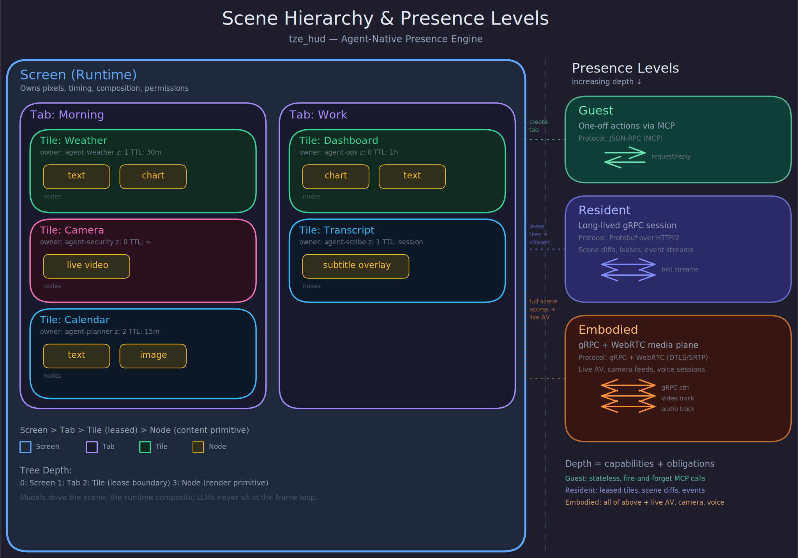

# Presence

Presence is the core abstraction of this system. An LLM does not "display content." It occupies territory on a living surface, holds it over time, and negotiates its use with the runtime and with other agents.



## Tabs and tiles

Tabs are not browser tabs. They are modes of the environment: Morning, Kitchen, Work, Security, Doorbell Interrupt, Night.

Tiles are not just containers. They are territories with:

- geometry
- z-order
- update policy
- sync-group membership
- input affordances
- latency class
- ownership or lease
- resource budget

Inside tiles live nodes. V1 ships: solid color, text/markdown, static image, and interactive hit region. Future node types include: live video surfaces, camera feeds, transcript strips, subtitle overlays, canvases, browser surfaces, charts, and agent avatars. The architecture supports adding node types without restructuring (see architecture.md).

The point is not to let an LLM generate pages. The point is to let it hold and negotiate territory on a living surface.

## Scene mutations are atomic

An agent often needs to make cohesive changes: create two tiles, set their content, assign them to a sync group, and switch to a new tab — all as one logical operation. The user should never see intermediate garbage: a half-built layout, a tab with one tile missing, or a flicker of default content before the real content arrives.

Scene mutations are therefore staged and committed atomically. An agent builds a batch of mutations, then commits the batch. The compositor applies the entire batch in one frame. If any mutation in the batch fails validation (invalid tile ID, exceeded budget, lease violation), the entire batch is rejected — no partial application.

This is not optional. Without transactional mutations, every multi-step scene change becomes a race between the agent's update rate and the compositor's frame rate. The Scene Contract RFC will define the batch format, but the principle is: agents never expose intermediate state to the user.

## Zones: the LLM-first publishing surface

Tiles are the low-level primitive: an agent requests a lease, specifies geometry, creates nodes, manages content. This is the full-control path. It is also too much work for the most common operations.

LLM interactivity is the core directive of this project. That means the common path — the path an LLM takes to put content on screen — must be as simple as possible. Zones are that path.

### Definition

A zone is a named, schema-typed, runtime-owned publishing surface that the compositor realizes using one or more managed surfaces and optional adjunct effects (sound, haptics).

Zones are more than rectangles. A notification zone may play a sound on urgent publishes. A subtitle zone on smart glasses may be audio-only with a minimal visual flash. An alert-banner may trigger a haptic pulse. These adjunct effects are part of the zone's rendering policy, not separate systems. The visual surface is the primary output; adjunct effects are policy-governed extensions of it.

### Zone anatomy

A zone has four distinct layers of definition:

- **Zone type.** The schema: accepted media/payload types, contention policy, default rendering policy, default privacy classification ceiling, default interruption class, and whether adjunct effects are available. "Subtitle" and "notification" are zone types.
- **Zone instance.** A zone type bound into a specific tab with a geometry policy and a layer attachment (see below). A "Morning" tab might have an instance of the "notification" zone type anchored to the top-right of the content layer.
- **Publication.** One publish event into a zone instance: content payload, TTL, key (for merge-by-key zones), priority, privacy classification, and optional stream/session identity for ongoing content.
- **Occupancy.** The runtime's resolved current state of a zone instance: what content is visible, which publications are active, what the effective geometry is after layout resolution. Agents can query occupancy but cannot set it directly.

This four-level structure prevents the common confusion of "is a zone the schema or the instance or the content?" The answer is: a zone type defines the schema, a zone instance is placed in a tab, publications push content into instances, and occupancy is what the runtime renders.

### Layer attachment

Every zone instance attaches to a specific compositor layer (see architecture.md, "Compositing model"):

- **Background layer.** ambient-background attaches here. Lowest z-order, behind all tiles. Runtime-owned; agents publish content but do not control positioning.
- **Content layer.** Most zones attach here: subtitle, notification, pip. They are realized as runtime-managed tiles within the content layer's z-order.
- **Chrome layer.** alert-banner and status-bar attach here. They render above all agent content. Agents can publish content to chrome-layer zones, but the content is rendered by the runtime — agents do not "render into chrome." The zone is the mediation layer: the agent publishes data, the runtime renders it in chrome using the zone's rendering policy.

This resolves the apparent contradiction "agents cannot render into chrome" vs "alert-banner renders in chrome." Agents publish to the zone; the runtime renders in chrome. The agent never touches the chrome layer directly.

### What zones are

A zone instance is a named publishing surface with:

- **A name and description.** Human-readable, discoverable by agents. "subtitle", "notification", "status-bar", "picture-in-picture", "ambient-background".
- **A geometry policy.** The zone knows where it goes on screen. The agent does not need to compute coordinates, margins, or aspect ratios. The runtime resolves the zone's geometry based on the current display profile, tab layout, and active zones.
- **Accepted media types.** Each zone declares exactly what content it accepts. A subtitle zone accepts stream-text with breakpoints. A notification zone accepts short text and an optional icon. A picture-in-picture zone accepts a video surface. Publishing the wrong type is a validation error, not a rendering bug.
- **Rendering policy.** Font size, alignment, margins, transitions, timeout behavior — all defined by the zone, not by the agent. The subtitle zone renders centered text in the bottom 5% of the screen with a semi-transparent backdrop. The agent does not specify any of this.
- **Upload/download protocol subset.** A zone can constrain which protocol plane is used for content delivery. A subtitle zone accepts ephemeral-realtime stream-text over gRPC. A video zone requires WebRTC media. This prevents agents from accidentally using the wrong transport for the content type.

### How agents use zones

Publishing to a zone is a single call:

```
publish("subtitle", stream_text("The quick brown fox", breakpoints=[4, 10, 16]))
publish("notification", {text: "Doorbell rang", icon: "doorbell", urgency: "urgent"})
publish("pip", video_surface_ref)
```

No tile creation. No geometry. No z-order. No lease negotiation for the common case. The zone handles all of it internally.

An agent needs a capability grant to publish to a zone (zones are governed like everything else), but once granted, publishing is zero-overhead from the agent's perspective.

Zone publishing is available on both protocol planes: via the gRPC session stream for resident agents, and via MCP tool calls (`publish_to_zone`, `list_zones`) for guest agents. MCP is the natural fit for zone publishing because both are designed for the same thing: zero-context, semantic operations that don't require scene awareness.

### Guest agents and zone leases

When a guest agent publishes to a zone via MCP, the guest does not acquire a lease. The zone's internal tile is owned by the runtime, not by the publishing agent. The guest's content is transient — it lives until the zone's timeout policy clears it, or until another publish replaces it. This is what makes zone publishing safe for guest agents: they contribute content without taking on the obligations (lease renewal, event handling, resource accounting) of residency.

### Zones manage tiles internally

A zone is implemented on top of the tile system, not beside it. When an agent publishes to the subtitle zone, the runtime creates (or reuses) a tile in the overlay layer, positions it according to the zone's geometry policy, and renders the content according to the zone's rendering policy. The agent never sees this tile directly.

This means zones inherit all the properties of the tile system: compositing, z-order, lease governance, telemetry, and headless testability. They are not a parallel rendering path — they are an opinionated wrapper around the existing one.

### Two APIs: orchestrate zones vs. publish to zones

This is an opinionated design choice that follows directly from the project's core directive of LLM interactivity.

**Zone orchestration** is the act of designing, creating, laying out, positioning, sizing, and configuring zones. It requires full scene context: display profile, tab layout, other zones, geometry constraints, media type declarations, rendering policies. Orchestration is a rich, context-heavy operation. It happens infrequently — at tab creation, layout changes, or mode switches.

**Zone publishing** is the act of pushing content to an existing zone by name. It requires almost no context: the zone name, the content (which must match the zone's declared media type), and the delivery semantics. Publishing is a lean, high-frequency operation. It happens continuously — every subtitle update, every notification, every status refresh.

These two operations are deliberately separated into different API surfaces because they have fundamentally different context requirements:

- An orchestrator agent (or the runtime's default configuration) orchestrates zones with full scene awareness. It decides: "the Security tab has a camera-pip zone in the top-right, a subtitle zone at the bottom, and an alert-banner zone at the top."
- A publisher agent publishes to zones with minimal context. It only needs: "publish this subtitle text to 'subtitle'." It does not know or care where the subtitle zone is, how large it is, or what font it uses.

This separation enables much better context management for LLMs. An orchestrating LLM needs a large context window with scene state, display capabilities, and layout logic. A publishing LLM needs a tiny context window with just the zone name and content schema. Different agents can fill different roles — or the same agent can orchestrate once (expensive, infrequent) and publish many times (cheap, continuous).

The orchestration API is transactional (zones are created/modified via atomic scene mutations). The publishing API is fire-and-forget for ephemeral content (subtitles, notifications) and acknowledged for durable content (status-bar values, background images).

### Zone definitions are part of the scene configuration

Zones can be defined statically (loaded from configuration at startup) or dynamically (created by an orchestrator agent at runtime). A "Morning" tab might ship with default zones for subtitle, notification, and ambient-background. An orchestrator agent might later add a weather-ticker zone or reconfigure the notification zone's position.

The zone registry is discoverable: an agent can query "what zones exist in the current tab, what do they accept, and do I have permission to publish to them?" This is critical for LLM agents — they can inspect the available zones and decide what to publish without hardcoding screen geometry or layout assumptions.

### Zone contention policy

When two agents publish to the same zone simultaneously, the zone's contention policy determines the outcome. Each zone type declares its policy:

- **Latest-wins** (subtitle, ambient-background): The most recent publish replaces the previous content. No queue, no merge. This is the right policy for ephemeral content where only the current value matters.
- **Stack** (notification): Publishes accumulate in a queue. Each notification renders independently and auto-dismisses after its timeout. Multiple agents can have active notifications simultaneously.
- **Merge-by-key** (status-bar): Each publish includes a key. Values with the same key are replaced; values with different keys coexist. An agent publishing `{key: "weather", value: "72°F"}` and another publishing `{key: "battery", value: "85%"}` both appear.
- **Replace** (pip): Only one occupant at a time. A new publish replaces the current one. The displaced agent receives a notification that its content was evicted.

The contention policy is part of the zone definition, not an agent choice. Agents do not need to coordinate with each other — the zone handles it.

### Zone geometry adapts to the display profile

The same zone definition produces different geometry on different display profiles. The subtitle zone on a 65" wall display renders larger text with wider margins than on a 6" phone. The picture-in-picture zone on a phone might be 30% of the screen; on a wall display, 10%. The notification zone on smart glasses might be audio-only with a minimal visual flash.

This is the mechanism by which "same scene model, different budgets" becomes concrete for content publishing. An agent publishes to "subtitle" — the runtime makes it look right on whatever display it's running on.

### Relationship to raw tiles

Zones do not replace tiles. They are the easy path for common patterns. An agent that needs custom layout, unusual geometry, or content types that no zone supports still uses the full tile API: request lease, specify geometry, create nodes, manage content.

The expectation is that most agents use zones for most of their output, and only drop to raw tiles for genuinely custom layouts. If an agent frequently needs raw tiles for something that should be a zone, that is a signal to define a new zone type — not to accept API complexity as the default.

### Example zones

These are illustrative, not exhaustive. The actual zone registry is defined per deployment.

**subtitle** — Content layer. Bottom of screen, ~5% height, centered, semi-transparent backdrop. Accepts stream-text with breakpoints. Ephemeral-realtime delivery. Auto-clears after timeout. Syncs to media clock if in a sync group. Contention: latest-wins.

**notification** — Content layer. Top-right corner, stacks vertically, auto-dismisses after timeout. Accepts short text + optional icon + urgency level. Adjunct: urgent notifications play a sound; critical notifications play a louder sound. Contention: stack.

**status-bar** — Chrome layer. Thin strip at top or bottom. Accepts key-value pairs rendered as a horizontal row. Coalesced updates (state-stream class). Always visible, never occluded by agent tiles. Contention: merge-by-key.

**pip** (picture-in-picture) — Content layer. Corner-anchored, draggable, resizable within bounds. Accepts a video surface reference. One pip per tab. Contention: replace (displaced agent notified).

**ambient-background** — Background layer. Full-screen behind all tiles. Accepts a static image, color, or slow-cycling gallery. Purely decorative — no input, no interaction. Contention: latest-wins.

**alert-banner** — Chrome layer. Full-width horizontal bar that pushes content down. Accepts text + severity level. Adjunct: critical alerts trigger haptic pulse if available. Used for system-level alerts, weather warnings, security events. Contention: stack by severity.

## Presence levels

Not every agent needs the same degree of embodiment. Presence level and agent role are orthogonal axes:

- **Presence level** (guest / resident / embodied) governs trust, transport, and resource access.
- **Agent role** (publisher, orchestrator, sensor-producer, interactive-app, etc.) governs what the agent is trying to do.

A resident agent can be a zone publisher, an orchestrator, or a dashboard producer. An embodied agent might only publish to a single zone. The capability system grants permissions; presence level determines the trust ceiling and available transport. Do not conflate them.

### Guest presence

The agent performs one-off actions: show note, open tile, display image, dismiss overlay. This is the natural fit for MCP-style tool use. No persistent connection required. Minimal trust required.

### Resident presence

The agent holds a long-lived session: subscribes to scene state, receives events, updates surfaces continuously, keeps ownership of one or more regions. This requires persistent gRPC streams. Moderate trust required — the agent has ongoing resource consumption and event access.

### Embodied presence

The agent has resident presence plus timed media and bidirectional interaction: streams audio/video, receives touch or button events, aligns text or highlights to media clocks, participates as a live entity. This requires separate media and control planes. Highest trust required — the agent has real-time media access and interactive capabilities.

## Leases: presence requires governance

If an LLM is a first-class citizen, it must also be a governed citizen.

Every resident or embodied agent receives:

- a namespace
- one or more surface leases
- capability scopes (what it can do)
- TTL and renewal semantics
- resource budgets (memory, bandwidth, update rate)
- allowed z-order or overlay privileges
- event subscriptions (what it can observe)
- revocation semantics (how and when the runtime can take it back)

This prevents the system from becoming attention spam. The human must always be able to: dismiss, mute, pin, freeze, shrink, revoke. The runtime must always remain sovereign.

## Multi-agent coordination

A presence engine that hosts multiple agents is not just "multiple tenants on a shared screen." Agents may need to be aware of each other, coordinate, and interact.

### Visibility

Topology visibility is policy-driven (see privacy.md for the canonical rule). By default, agents see only their own leases and the public structure of the scene (tab names, tile geometry) — not which other agents hold which leases. Agents with an explicit topology-read capability grant can see the full scene topology including other agents' lease metadata. No agent can see the content of another agent's tiles or event streams regardless of capability level.

An agent can publish selected state to a shared namespace if it chooses. This is opt-in, not default.

### Negotiation

Agents do not negotiate territory directly with each other. All negotiation goes through the runtime. An agent requests a region; the runtime grants, denies, or counter-offers based on available space, budgets, priorities, and the current lease map.

If two agents want overlapping territory, the runtime arbitrates. Agents can express preferences (preferred region, minimum acceptable size, priority hint) but the runtime decides.

### Orchestration

The runtime supports an optional orchestrator role: a privileged agent that can manage other agents' presence. An orchestrator can:

- suggest or enforce tab layouts
- create, modify, and remove zones (zone orchestration — see "Two APIs" above)
- invite or dismiss sub-agents
- coordinate scene transitions (e.g., "switch to Security mode: bring up cameras, dismiss ambient dashboard")
- act as a meta-agent that composes agent presences into coherent experiences

An orchestrator holds elevated lease privileges but is still subject to the runtime's sovereignty. The human can always override.

### Inter-agent events

Agents can subscribe to a shared event bus for coarse-grained coordination signals: "tab switched," "new agent joined," "agent departed," "user dismissed tile," "scene entering degraded mode." These are scene-level events, not agent-to-agent messages. Direct agent-to-agent communication is out of scope for the presence engine — agents that need to talk to each other do so through their own channels outside the runtime.

## Interaction

Two-way interaction is mandatory. The system supports: touch, pointer, buttons, local keyboard/mouse, voice triggers, sensor-initiated interrupts, and app-to-agent callbacks.

The interaction model is local-first. The human should never feel like they are "clicking through a cloud roundtrip." A pressed state, focus ring, or visual acknowledgement happens locally and instantly. Remote semantics follow. Local feedback cannot wait.

### Focus model

Focus is per-tile, not per-agent. At most one tile has keyboard/text focus at any time. An agent that owns multiple tiles has focus in at most one of them. The runtime manages focus transitions — an agent cannot forcibly steal focus from another agent's tile.

Focus is also local-first: the runtime updates the visual focus indicator (ring, highlight, cursor) immediately on input, before notifying the agent. The agent learns it received focus via an event, not by observing a visual change.

### Input routing and bubbling

Input events are routed through the scene graph. A pointer event first hit-tests against the chrome layer (runtime UI always wins), then against tiles in z-order (highest first), then against nodes within the hit tile.

If a node or tile does not handle an event, it bubbles up: node → tile → tab → runtime. This means an unhandled click on a text node inside a tile can be caught by the tile's hit region, or by the runtime's default behavior (e.g., focus the tile).

### Gesture arbitration

When two tiles could plausibly claim the same gesture (a swipe that crosses a tile boundary, a pinch that starts in one tile and ends in another), the runtime arbitrates. The default policy is: the tile where the gesture started owns it. The Input RFC will define the full arbitration model, but the principle is that the runtime decides — agents do not race for gestures.

### IME, text input, and accessibility

Text input, input method editors (IME), and accessibility hooks (screen readers, switch access) are acknowledged as first-class requirements. They are not afterthoughts to be bolted on later. The Input RFC must address them. The doctrine-level commitment is: the runtime exposes accessibility metadata for the scene graph (tile names, node roles, focus state) through platform accessibility APIs. Agents declare semantic roles for their nodes; the runtime bridges to the platform.
