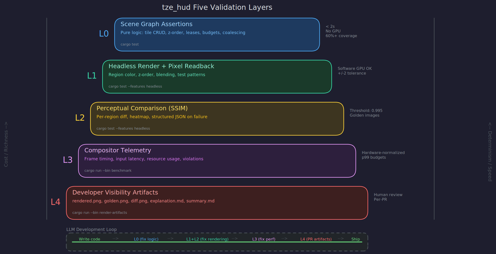

# Validation Architecture

This project is built primarily by LLMs. The validation architecture is not a secondary concern bolted on after the first prototype. It is a load-bearing part of the design, because without it the primary developers cannot close the build-validate-iterate loop.

LLMs cannot look at a screen. They cannot eyeball whether a tile rendered correctly, whether an overlay is blending right, whether a transition feels smooth. Traditional browser testing tools like Playwright do not apply — this is a native GPU compositor, not a DOM. Every aspect of the system that matters — visual correctness, layout fidelity, performance, timing — must be observable through structured, machine-readable output that an LLM can parse, reason about, and act on.

This is not a limitation to work around. It is a design advantage. If the system is testable enough for an LLM to validate autonomously, it is testable enough for humans to trust.

## Testing doctrine: spirit over letter

Tests are first-class citizens of this project. Not in the sense that every function gets a test — in the sense that the test suite is the authoritative expression of what the system promises.

The north star is not "all tests pass." The north star is: consistent, deterministic, performant functionality, with intuitive and cleanly designed APIs. Tests exist to measure distance from that star and to close it over time. A passing test suite that masks flaky behavior, hides performance drift, or validates a bad API is worse than a failing suite that tells you exactly what is wrong.

The spirit of a test matters more than the letter. A test that checks "the function returns 42" is low-value if it says nothing about why 42 is correct, whether 42 is stable across runs, or whether the path to 42 is fast enough. A test that checks "the lease state machine never reaches an invalid state under 10,000 random mutation sequences" is high-value even if it never checks a single specific value — because it validates an invariant that the system must always hold.

## Tests as the engine of recursive self-improvement

The test suite is the primary mechanism by which LLMs improve the codebase over time. An LLM cannot intuit whether code "got better." It needs a measurement. That measurement is the test suite: correctness assertions, performance telemetry, API ergonomic checks, invariant verification.

This creates a virtuous cycle: LLMs write code, tests quantify what improved and what regressed, LLMs read the structured results, LLMs fix the regressions and push further on the improvements. Over many iterations, the codebase converges toward higher quality not because any single LLM session is perfect, but because the test suite creates consistent selective pressure in the right direction.

For this to work, tests must:

**Be honest.** A test that is too easy to pass teaches the LLM nothing. A test that can be gamed by overfitting to the assertion (rather than fixing the underlying issue) actively harms the codebase. Prefer invariant-based tests over point-value tests. Prefer property-based tests over example-based tests where the domain allows it.

**Be stable.** A flaky test poisons the feedback loop. If an LLM sees a test fail, it must be able to trust that the failure reflects a real problem. Determinism is not optional. Time-dependent tests use injectable clocks. Order-dependent tests are bugs.

**Be diagnostic.** When a test fails, the output must tell the LLM what went wrong, where, and by how much. "assertion failed: left != right" is useless. "frame_time_p99 was 22.3ms, budget is 16.6ms, regression of 34% in scene 'coalesced_dashboard', first exceeded at frame 847" is actionable. Structured failure output is as important as structured success telemetry.

**Quantify improvement over time.** Performance metrics must be tracked across runs so that LLMs can see trends, not just pass/fail. A change that moves p99 frame time from 14.1ms to 14.8ms passes the 16.6ms budget but represents a 5% regression that compounds. The test suite should surface these trends, not hide them behind a green checkmark.

## Hardware-normalized performance

Raw timing numbers are meaningless across machines. A 12ms frame time on a development laptop and a 12ms frame time on a CI runner with mesa llvmpipe are completely different statements about performance.

All performance metrics are normalized to hardware capability using a calibration vector, not a single scalar. A compositor can be CPU-bound in scene mutation, GPU fill-bound in composition, or upload-bound in texture-heavy cases. One scalar hides regressions when the bottleneck shape changes.

At the start of every benchmark run, execute three fixed calibration workloads:

1. **Scene-graph CPU calibration.** Rapid scene mutation (create, delete, resize, reparent tiles) with no rendering. Measures pure CPU scene-graph throughput.
2. **Fill/composition GPU calibration.** Render a fixed multi-tile scene with overlapping alpha-blended regions at target resolution. Measures GPU composition throughput.
3. **Upload-heavy resource calibration.** Create and update many texture-backed tiles in rapid succession. Measures texture upload and memory management throughput.

Each produces a hardware factor for its dimension. All subsequent measurements are reported both raw and normalized against the relevant factor. Performance budgets and regression thresholds are defined in normalized units per dimension.

A CI runner on llvmpipe might have factors of {cpu: 0.8, gpu: 0.12, upload: 0.15} — scene-graph tests run near native speed while GPU-bound tests need wide normalization.

The calibration workloads are stable across code changes (they exercise the renderer infrastructure, not application logic), versioned, and only change deliberately. This lets LLMs compare performance across runs on different machines, detect regressions in specific bottleneck dimensions, and reason about headroom in absolute terms.

## Fuzzing and chaos testing

Deterministic tests validate that the system works as designed. Fuzzing and chaos tests validate that the system survives what was not designed for.

**Fuzzing the scene graph.** Feed the scene mutation API random operation sequences — create, delete, resize, reparent, change z-order, grant leases, revoke leases, switch tabs — and verify invariants hold after every operation. The scene graph must never crash, never reach an internally inconsistent state, never leak resources. Property-based testing in Layer 0 is the lightweight version; dedicated fuzzing with cargo-fuzz is the thorough version, run on longer cycles.

**Fuzzing the protocol boundary.** Feed gRPC and MCP entry points malformed, oversized, out-of-order, and adversarial messages. The system must reject invalid input without crashing, hanging, or corrupting state. Every protocol boundary is a fuzz target.

**Chaos testing the compositor under load.** Sudden lease revocations mid-render, media streams that stall or deliver out-of-order frames, agents flooding state-stream updates beyond coalescing budget, network partitions during gRPC streams, GPU memory allocation failures. The compositor must degrade gracefully — drop frames, shed load, revoke leases, fall back to simpler rendering — not crash or deadlock.

**Chaos testing the timing model.** Inject clock skew, jitter, and discontinuities. Sync groups must reconverge. Timed cues must not pile up. Expired leases must be revoked even if the clock jumps forward. The timing model must be robust to real-world clock behavior, not just ideal monotonic progress.

When fuzzing discovers a crash or invariant violation, it produces a minimal reproducer that becomes a permanent regression test — encoding the lesson.

The point is to apply these techniques wherever they intuitively help: external input boundaries, complex state machines, concurrent interactions, timing-sensitive paths. Do not fuzz things better served by the type system. Do not write point-value tests for properties better served by property-based testing. Match the test to the risk.

## API quality as a tested property

The test suite is also a litmus test for API design. If a test is awkward to write — excessive setup, deep knowledge of internals, fragile ordering, opaque types — that is a signal the API is poorly designed, not that the test is wrong.

Tests should read like usage examples. If an LLM struggles to write a correct test for a public API, a human developer will struggle to use that API. When testing a feature requires ugly workarounds, the correct response is often to improve the API rather than write a more complex test. Clean APIs produce clean tests produce reliable LLM feedback loops.

## Design requirements

These are non-negotiable and must be satisfied from the first compilable compositor:

**DR-V1: Scene model separable from renderer.** The scene graph must be a pure data structure — constructable, mutable, queryable, serializable, and assertable without any GPU context.

**DR-V2: Headless rendering.** Render a complete frame to an offscreen texture with no window, no display server, no user interaction. Feature-equivalent to windowed for scene composition. Activated by feature flag or runtime config, never by forking the render pipeline.

**DR-V3: Structured telemetry.** Every frame emits a machine-readable telemetry record. This is both the CI surface and the production observability surface.

**DR-V4: Deterministic test scenes.** A scene registry with named, versioned configurations that produce reproducible output. All randomness seeded. All time sources injectable. All media inputs synthetic.

**DR-V5: Trivial headless invocation.** `cargo test --features headless` runs the full suite. No manual setup, no environment hacks.

**DR-V6: No physical GPU required for CI.** Headless path works on mesa llvmpipe or SwiftShader. Perceptual thresholds account for software/hardware differences.

## Five validation layers

Ordered from cheapest and most deterministic to richest and most human-oriented. Each catches a different class of problem.

### Layer 0: Scene graph assertions

Pure logic tests on the scene data structure. No rendering, no GPU. Standard `#[test]` functions.

Validates: tile CRUD, z-order consistency, lease state machine, tab transitions, sync group invariants, capability negotiation, hit testing, resource budgets, mobile degradation policy, coalescing logic, zone registry operations (create/query/publish), zone type validation (reject wrong media type), zone contention policies (latest-wins, stack, merge-by-key, replace), and zone geometry policy resolution.

Assertions are structural: "tile exists at bounds X," "no two exclusive tiles overlap," "coalesce of three updates produces final state."

Property-based testing generates random scene configurations and verifies invariants: tiles within bounds, lease state machine valid, z-order total, budgets non-negative.

Runs in under two seconds. Fully deterministic. No external dependencies. Should cover 60%+ of test cases.

### Layer 1: Headless render and pixel readback

Render test scenes to offscreen textures, read back pixels, assert on content.

- **Region color:** rectangular region matches expected color within tolerance.
- **Structural:** edge at coordinate X, alpha less than 1.0, resolution matches.
- **Test patterns:** solid colors, gradients, checkerboards — exact values, no heuristics.
- **Z-order:** overlap region matches higher-z tile's color.
- **Blending:** semi-transparent overlay produces predictable blended color.

Media tiles use synthetic frame sources with known pixels at known timestamps. Software GPU tolerance: ±2 per channel for blending, ±1 for solid fills.

### Layer 2: Visual regression via perceptual comparison

Compare rendered output against golden reference images using SSIM (Structural Similarity Index), not pixel-exact comparison. Threshold: 0.995 for layout, 0.99 for media composition. Perceptual hash for fast pre-screening.

On failure: per-region SSIM, diff heatmap, structured JSON. Goldens committed to repo, named by scene and backend. Regenerated when rendering intentionally changes.

### Layer 3: Compositor telemetry and performance validation

Per-frame telemetry: frame timing (scene update, CPU render, GPU submit, present, total), throughput (tiles, draw calls, texture uploads, coalesced updates, dropped ephemerals), resources (texture memory, GPU buffers, active leases/streams), correctness (lease violations, z-order conflicts, budget overruns, sync group drift).

Per-session aggregates: total frames, FPS, frame time at p50/p95/p99, latency breakdown at p50/p95/p99 (see below), peaks, violation totals.

**Latency budgets (split, not conflated).** "Input-to-pixel" is not one measurement — it conflates application latency with presentation cadence. The telemetry tracks three distinct latencies:

- **input_to_local_ack** — time from input event to local visual feedback (press state, focus ring, hover highlight). Budget: p99 < 4ms. This is purely local, no network, no agent involvement.
- **input_to_scene_commit** — time from input event to the scene graph reflecting the agent's response (agent receives event, processes, sends mutation, mutation applied). Budget: p99 < 50ms for local agents, varies for remote.
- **input_to_next_present** — time from input event to the next rendered frame containing the committed scene change appearing on screen. This is refresh-rate-dependent: at 60Hz the floor is ~16.6ms even if the scene commits instantly. Budget: p99 < 33ms (within two frames at 60Hz).

**Other performance budgets:** p99 frame time < 16.6ms (normalized), zero lease violations, zero budget overruns, sync drift < 500μs, texture memory under budget.

Benchmark binary runs scenarios headlessly, emits JSON. Same telemetry schema in production at configurable sampling rate.

### Layer 4: Developer visibility artifacts

For medium-to-high complexity tasks, the validation pipeline renders timestamped visual artifacts to a results folder.

**Output structure:** `test_results/{YYYYMMDD-HHmmss}-{branch}/`

- `index.html` — self-contained browsable gallery. Scene thumbnails, pass/fail badges, click-to-expand rendered vs golden with diff overlay, benchmark charts, status filter.
- `manifest.json` — machine-readable index of scenes and benchmarks with status, metrics, artifact paths.
- `scenes/{name}/` — `rendered.png`, `golden.png`, `diff.png`, `telemetry.json`, `explanation.md`
- `benchmarks/{name}/` — session telemetry, auto-generated histograms.
- `summary.md` — narrative overview of the run.

**explanation.md per scene** is generated by the test harness from scene registry metadata: what the scene tests, what to look for visually, automated results, changes since previous golden.

**When generated:** every PR CI run, any visual regression failure, on LLM request, nightly baselines against main. Retention: 30 days, except milestone baselines.

LLMs include summary.md in PR descriptions so human reviewers know what to inspect.

## The LLM development loop

1. Write or modify code.
2. `cargo test` — Layer 0 scene graph assertions (< 2s). Fix logic errors.
3. `cargo test --features headless` — Layers 1+2 pixel and regression tests. Fix rendering, regenerate goldens if intentional.
4. `cargo run --bin benchmark --features headless -- --emit telemetry.json` — Layer 3 performance. Parse JSON, fix regressions.
5. `cargo run --bin render-artifacts --features headless` — Layer 4 visibility artifacts. Include summary.md in PR.
6. If any layer fails: read structured output, diagnose, iterate, go to 1. If all pass: commit, push, open PR.

Steps 2-4 need no human. Step 5 is the bridge: visual artifacts for optional human inspection.

## Test scene registry

Named, versioned scene definitions shared across all five layers. Each defines: scene graph, synthetic content, Layer 0 invariants, Layer 1 pixel expectations, Layer 2 golden, Layer 3 budgets, Layer 4 explanation.

Initial corpus:

- `empty_scene` — no tiles, validates clean startup
- `single_tile_solid` — basic rendering
- `three_tiles_no_overlap` — layout
- `overlapping_tiles_zorder` — z-order compositing
- `overlay_transparency` — alpha blending
- `tab_switch` — transition before/after
- `lease_expiry` — tile cleanup on TTL
- `mobile_degraded` — reduced profile
- `sync_group_media` — timed test frames
- `input_highlight` — local feedback state
- `coalesced_dashboard` — high-rate coalesced output
- `max_tiles_stress` — performance under max load
- `three_agents_contention` — three resident agents competing for overlapping screen territory, runtime arbitration, lease priority resolution
- `overlay_passthrough_regions` — HUD overlay mode with interactive tiles and passthrough gaps, validates click-through routing matches scene graph
- `disconnect_reclaim_multiagent` — one of three agents disconnects mid-scene, validates orphan handling, grace period, tile reclaim without affecting other agents' tiles
- `privacy_redaction_mode` — tiles with mixed visibility classifications under a guest viewer context, validates redaction behavior and layout stability
- `chatty_dashboard_touch` — high-rate state-stream updates on a dashboard tile while simultaneous touch input targets an adjacent interactive tile, validates coalescing does not starve input responsiveness
- `zone_publish_subtitle` — agent publishes stream-text with breakpoints to subtitle zone, validates geometry policy (centered, bottom 5%, margins), rendering policy (backdrop, font), and auto-clear timeout
- `zone_reject_wrong_type` — agent attempts to publish a video surface to the subtitle zone, validates clean rejection with structured error (not a rendering glitch)
- `zone_conflict_two_publishers` — two agents publish to the same subtitle zone simultaneously, validates latest-wins contention policy; same test with notification zone validates stack policy
- `zone_orchestrate_then_publish` — static zone configuration loaded, agent queries zone registry, publishes to discovered zone. Tests the full orchestrate→discover→publish flow end-to-end
- `zone_geometry_adapts_profile` — same zone definition rendered at two display resolutions, validates geometry policy produces different but correct layout for each
- `zone_disconnect_cleanup` — agent publishes to subtitle zone then disconnects. Validates subtitle auto-clears after timeout. Separate case: agent publishes to status-bar then disconnects. Validates status-bar persists until replaced

## Additional test categories

### Protocol conformance tests

The five validation layers cover rendering and scene logic. Protocol conformance tests cover the wire surface: does the gRPC service correctly reject an invalid protobuf? Does the MCP tool return the right JSON-RPC error with structured details? Does a malformed zone publish get a diagnostic error response, not a crash?

These tests operate at the protocol boundary, not the scene graph level. They verify: schema validation, error response structure (code + context + correction hint per the error model), version negotiation, unknown-field handling, and graceful rejection of oversized payloads. They are a natural complement to protocol boundary fuzzing — fuzzing finds crashes, conformance tests verify correct behavior.

### Soak and leak tests

Hours-long sessions with repeated agent connects, disconnects, reconnects, lease grants, revocations, zone publishes, and content updates. Verify: no monotonically growing memory, no orphaned resources, no leaked file descriptors, no accumulating scene graph garbage.

Soak tests run on longer cycles (nightly, not per-commit). Their pass criteria are: resource utilization at hour N is within 5% of resource utilization at hour 1 for the same steady-state workload. Any monotonic growth is a bug.

These tests are particularly important for the resource lifecycle contract: after an agent disconnects and its leases expire, its resource footprint must be zero.

## Open questions for the RFC

- **Golden storage:** Git LFS or separate artifact store?
- **Cross-backend goldens:** per-backend golden sets, or wide tolerance with one?
- **Media decode in headless tests:** synthetic-only, or real GStreamer decode with test files?
- **Artifact hosting:** CI ephemeral storage, persistent server, or separate branch?
