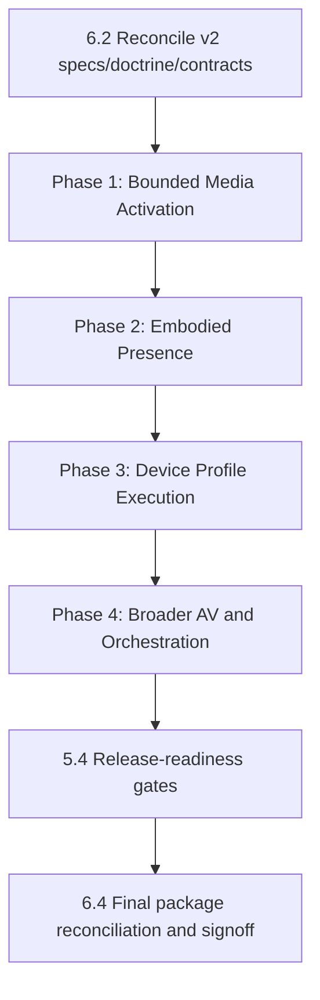

# V2 Embodied/Media Program Beads Graph

Date: 2026-04-09  
Issue: `hud-8cy3.3`  
Change: `openspec/changes/v2-embodied-media-presence`

## Scope

This artifact converts the approved v2 phase plan and task inventory into a dependency-ordered bead graph for execution.

Sources:

1. `execution-plan.md`
2. `tasks.md`
3. `reconciliation.md`
4. `about/heart-and-soul/v1.md`
5. `about/heart-and-soul/development.md`

## Graph Rules

1. Preserve phase order: `Phase 1 -> Phase 2 -> Phase 3 -> Phase 4`.
2. Keep validation/observability beads in each phase as entry/exit gates, not endcaps.
3. Keep v1 boundary and bounded-ingress-first constraints explicit.
4. Keep one final reconciliation bead before execution-readiness declaration.

## Program DAG (Phase + Gate Level)

Note: `6.4` maps to bead `hud-8cy3.4` (existing final reconciliation bead) and is tracked explicitly in `tasks.md`.

## Detailed Execution Graph (Task-Level Beads)

### Wave 0: Program Integrity Gates

1. `6.2` Reconcile v2 specs against doctrine, RFCs, and bounded-ingress tranche.
2. `6.3` Generate and freeze dependency graph artifact (this bead).

### Wave 1: Phase 1 (Bounded Media Activation)

1. `1.1` Promote bounded ingress to implementation-ready capability.
2. `1.2` Land signaling and schema/snapshot parity. Depends on `1.1`.
3. `1.3` Implement activation gate/policy/telemetry. Depends on `1.1`, `1.2`.
4. `1.4` Implement compositor `VideoSurfaceRef` render path. Depends on `1.2`, `1.3`.
5. `5.1` Extend validation lanes for media/device rehearsals (minimum for Phase 1). Depends on `1.3`.
6. `5.3` Add structured observability for media transitions. Depends on `1.3`.
7. `1.5` Validate bounded ingress in synthetic + real-decode lanes. Depends on `1.4`, `5.1`, `5.3`.

### Wave 2: Phase 2 (Embodied Presence)

1. `2.1` Define embodied level/session identity/operator visibility. Depends on `1.5`.
2. `2.2` Bind media admission to embodied authority. Depends on `2.1`.
3. `2.3` Specify reconnect/reclaim/failure behavior. Depends on `2.1`, `2.2`.
4. `2.4` Add operator controls and audit surfaces. Depends on `2.1`, `2.2`, `2.3`.

### Wave 3: Phase 3 (Device Profile Execution)

1. `3.1` Convert mobile profile to exercised runtime profile. Depends on `2.4`.
2. `3.2` Define glasses/companion composition and degradation. Depends on `3.1`.
3. `3.3` Add constrained-device capability negotiation. Depends on `3.1`, `3.2`.
4. `5.2` Define runner strategy and calibration for device lanes. Depends on `3.1`.
5. `3.4` Validate profile performance/privacy/operator behavior. Depends on `3.2`, `3.3`, `5.2`.

### Wave 4: Phase 4 (Broader AV and Orchestration)

1. `4.1` Define admission criteria for bidirectional AV. Depends on `3.4`.
2. `4.2` Define audio routing/mixing and household policy. Depends on `4.1`.
3. `4.3` Define multi-feed orchestration/layout/priority contracts. Depends on `4.1`, `4.2`.
4. `4.4` Add embodied/media orchestration rules. Depends on `4.3`.

### Wave 5: Program Closeout

1. `5.4` Define release-readiness gates for v2 capability claims. Depends on `4.4`.
2. `6.4` Final reconciliation bead (`hud-8cy3.4`) for proposal/design/spec/tasks/evidence coherence. Depends on `5.4`.

## Parallelism Envelope

The following lanes may run in parallel without violating the phase contract:

1. In Phase 1, `5.1` and `5.3` can run in parallel after `1.3`.
2. In Phase 3, `5.2` can run in parallel with `3.2` after `3.1`.
3. All other milestones remain serialized by phase gates.

## Bead Creation Template (for coordinator execution)

When expanding this graph into concrete beads, use one bead per task ID (`1.1`, `1.2`, ..., `5.4`) plus one explicit final reconciliation bead (`6.4` -> `hud-8cy3.4`).

Recommended metadata:

1. Type: `task` (or `feature` for large implementation beads with clear acceptance slices).
2. Priority:
   - P1 for Waves 0 to 2.
   - P2 for Waves 3 to 5.
3. Dependency edges: exactly as listed above; no implicit ordering.
4. Every bead description should include:
   - task ID and source file reference (`tasks.md`)
   - required evidence artifacts
   - validation/lint/test commands expected for closure

## Acceptance Condition for This Artifact

This bead is complete when:

1. The graph is explicit and dependency-ordered.
2. Phase gates match `execution-plan.md`.
3. Task IDs map 1:1 to `tasks.md`.
4. The final reconciliation gate (`hud-8cy3.4`) is represented as terminal pre-signoff work.
